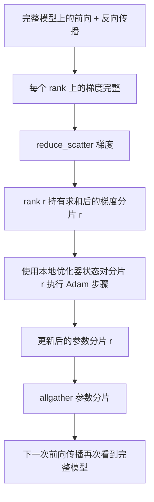

# ZeRO 优化器状态分片

> Adam 为每个参数存储两个动量估计值，均采用 float32 格式。一个 7B 参数模型需要 56 GB 的优化器状态。ZeRO 阶段 1 将该状态分片到 N 个 rank 上；每个 rank 拥有 1/N 的优化器状态。本地步骤完成后，更新后的参数分片广播回来，每个 rank 重构完整模型，然后开始下一步。其优势在于训练堆栈中最大单一分配的内存呈线性下降。

**类型：** 构建
**语言：** Python
**前置条件：** 阶段 19 轨道 C 第 42-49 课
**时间：** ~90 分钟

## 学习目标

- 将优化器状态（一阶动量、二阶动量、fp32 主副本）分片到 N 个 rank 上，使每个 rank 拥有 1/N。
- 使用 reduce_scatter 为每个 rank 仅提供其分片的梯度总和，然后使用 allgather 将更新后的参数分片广播回来。
- 计算阶段 1、阶段 2、阶段 3 相对于普通 DDP 的内存节省表。
- 根据模型规模和带宽预算，论证阶段 1、阶段 2 和阶段 3 的选择。

## 问题

普通 DDP 复制所有内容：参数、梯度和优化器状态在每个 rank 上完整存在。对于一个 7B 参数的 fp16 模型，这意味着每个 rank 需要 14 GB 参数、14 GB 梯度和 28 GB 优化器状态。优化器状态是最大的部分，也是最容易分片的，因为它仅在步骤期间被触及，而不在前向或反向传播中。

ZeRO 阶段 1 对优化器状态进行分片。每个 rank 持有 1/N 的 Adam 动量。反向传播之后，ZeRO 不使用全量梯度的 allreduce 并在本地执行步骤，而是使用 reduce_scatter，使得每个 rank 只接收其分片的求和梯度。该 rank 对其主参数分片应用优化器步骤。更新后的参数分片随后通过 allgather 广播回来，因此每个 rank 都拥有完整模型以进行下一步前向传播。优化器内存减少至原来的 1/N。每步的线路流量与 DDP 相同：一次 reduce_scatter 加一次 allgather 在带宽上等于一次 allreduce。内存节省，吞吐量保持不变。

## 概念



### ZeRO 的阶段

| 阶段 | 分片内容 | 每个 rank 的内存 | 每步通信量 |
|-------|----------|------------------|------------|
| DDP | 无 | 参数 + 梯度 + 优化器 | 1 次 allreduce |
| ZeRO-1 | 优化器状态 | 参数 + 梯度 + 优化器/N | 1 次 reduce_scatter + 1 次 allgather |
| ZeRO-2 | 优化器 + 梯度 | 参数 + 梯度/N + 优化器/N | 1 次 reduce_scatter + 1 次 allgather |
| ZeRO-3 | 优化器 + 梯度 + 参数 | 参数/N + 梯度/N + 优化器/N | 每层 1 次 allgather + 每层 1 次 reduce_scatter |

阶段 1 是最经济的收益，因为优化器状态占预算主导。阶段 2 需要梯度分片累积逻辑，但带宽相同。阶段 3（FSDP）在每次前向和反向传播中为每层支付通信开销，以获得参数分片的内存节省。本课程完整实现阶段 1。

### 内存计算，真实数据

对于使用 Adam 进行混合精度训练的 P 参数模型：

| 项 | 普通 | ZeRO-1 | 原因 |
|------|---------|--------|------|
| fp16 参数 | 2P 字节 | 2P 字节 | 前向传播需要 |
| fp16 梯度 | 2P 字节 | 2P 字节 | 反向传播需要 |
| fp32 主副本 | 4P 字节 | 4P/N 字节 | 仅优化器使用 |
| fp32 一阶动量 | 4P 字节 | 4P/N 字节 | 仅优化器使用 |
| fp32 二阶动量 | 4P 字节 | 4P/N 字节 | 仅优化器使用 |
| 总计 | 16P 字节 | 4P + 12P/N 字节 |  |

当 N=8 时：普通 16P，ZeRO-1 5.5P，下降 65%。当 N=64 时：普通 16P，ZeRO-1 4.19P，下降 74%。

### 为什么 reduce_scatter 优于 allreduce-再-分片

Allreduce 为每个 rank 提供完整的求和后梯度。如果你只需要分片 r，那么 (N-1)/N 的已规约梯度在 rank r 上被浪费了。Reduce_scatter 精确地传递每个 rank 所属的分片；每个 rank 的字节数与 allreduce 相同（因为 allreduce 就是 reduce_scatter 加 allgather），但后半部分被后续的参数分片 allgather 所替代。净线路流量与 DDP 相同，而内存被分而治之。

## 构建它

`code/main.py` 实现：

- `flatten_params(module)` 和 `unflatten_into(module, flat)`，将模型的参数打包成一个连续的张量并解包回来。扁平布局使得按 rank 分片只需简单的切片操作。
- `ZeroOptimizer(model, world_size, rank, lr)`，拥有该 rank 的主副本和 Adam 动量分片。
- `step()`，对扁平梯度执行 reduce_scatter，对 rank 的分片应用 Adam，然后通过 allgather 将更新后的参数广播回来。
- 一个演示程序，训练一个 3 层 MLP 共 20 步，并输出每步的内存预算以及普通 DDP 的基线对比。

运行它：

```bash
python3 code/main.py
```

输出：每步的损失值和内存表，显示 ZeRO-1 在每个 rank 上持有的优化器状态仅为 DDP 完整副本的 1/N。

## 生产环境中的实际模式

以下三种模式将 ZeRO 加固到可投产的程度。

**分片检查点至关重要。** ZeRO-1 的优化器状态分布在多个 rank 上；检查点必须记录哪个 rank 拥有哪些内容。第 80 课构建了分片检查点清单，用于在相同世界规模下恢复 ZeRO 运行。没有它，保存的状态在重启时将无法读取。

**混合精度是关键。** ZeRO 是一种混合精度技术；被分片的是 fp32 主副本。在没有混合精度的情况下运行 ZeRO，需要为 fp32 主副本付出内存代价，却得不到相应的 fp16 前向优势。生产运行总是将 ZeRO 与 autocast 或 bf16 权重配对使用。

**阶段 1 几乎是零成本的收益。** 通信量在带宽上与 DDP 相同。内存节省与 N 成线性关系。唯一的代价是优化器分片的簿记工作。生产堆栈默认使用阶段 1，除非参数分片内存也成为问题；此时阶段 2 或 3 用通信换取内存。

## 使用它

生产模式：

- **DeepSpeed ZeRO。** 参考实现。`deepspeed_config.json` 选择阶段 1/2/3 及分区大小。
- **PyTorch FSDP。** PyTorch 原生等价实现。`ShardingStrategy.SHARD_GRAD_OP` 对应 ZeRO-2；`FULL_SHARD` 对应 ZeRO-3。
- **HuggingFace Accelerate。** 在统一配置下封装 DeepSpeed 和 FSDP。

## 延伸

第 79 课（流水线并行）是正交的分片轴：不是在同一模型上分片优化器状态，而是将层分片到不同的 rank 上。第 81 课在端到端演示中组合了 DDP + ZeRO。

## 练习

1. 扩展到 ZeRO-2，对梯度进行分片：每个 rank 只存储其分片的梯度，通过在反向传播后将非分片部分清零来实现。
2. 添加一个内存分析器，在 rank 0 上输出实际的 fp32 字节使用量并与公式预测值进行比较。
3. 测量普通 DDP 与 ZeRO-1 的每步墙钟时间，并将其分解为前向、反向和通信三个阶段。
4. 在 ZeRO-1 下实现梯度裁剪：L2 范数必须通过本地范数平方的 allreduce 在所有分片上计算。
5. 实现一个使用 allreduce 代替 reduce_scatter 的"朴素 ZeRO"，测量线路时间的差异。用数据论证 reduce_scatter 的选择。

## 关键术语

| 术语 | 人们常说的意思 | 实际含义 |
|------|----------------|----------|
| ZeRO-1 | "分片优化器" | 每个 rank 持有 1/N 的 fp32 主副本 + Adam 动量 |
| ZeRO-2 | "也分片梯度" | 每个 rank 在 reduce_scatter 后丢弃非分片梯度 |
| ZeRO-3 | "分片参数" | 每个 rank 持有 1/N 的 fp16 参数；前向传播中逐层 allgather |
| 主副本 | "fp32 权重" | 优化器更新的高精度参数副本 |
| Reduce_scatter | "拆分求和" | 为每个 rank 仅传递其分片的求和梯度 |

## 延伸阅读

- [Rajbhandari 等人，ZeRO：面向训练万亿参数模型的内存优化](https://arxiv.org/abs/1910.02054)
- [DeepSpeed ZeRO 文档](https://www.deepspeed.ai/tutorials/zero/)
- [PyTorch FSDP 文档](https://pytorch.org/docs/stable/fsdp.html)
- 阶段 19 第 76 课——本课程所依赖的 reduce_scatter 和 allgather
- 阶段 19 第 80 课——ZeRO 状态必须使用的分片检查点
