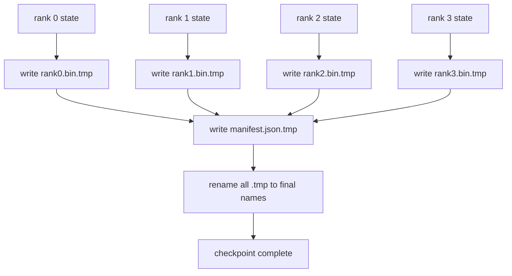

# Parçalanmış Kontrol Noktası ve Atomik Devam

> 70B parametreli bir eğitim işi, birkaç saatte bir düğüm arızası nedeniyle duraklatılır. Kontrol noktası formatı 30 dakika mı yoksa 30 saat mi kaybedeceğinize karar verir. Parçalı bir kontrol noktası, her kademenin parçasını paralel olarak yazar ve sahipliği bir bildirimde kaydeder. Devam ettirme, her kademenin parçasını kendi dosyasından yükler, durumu aynı dünya boyutunda yeniden yapılandırır ve optimize edici sanki hiçbir şey olmamış gibi adım atar. Atomik yazma, yarı tamamlanmış bir kontrol noktasının bir sonraki özgeçmişi zehirlemesini önler.

**Tür:** Yapım
**Diller:** Python
**Önkoşullar:** Aşama 19 Bölüm C dersleri 42-49
**Süre:** ~90 dk

## Öğrenme Hedefleri

- Çok kademeli bir kontrol noktasını, derece başına parça dosyası olarak ve hangi rütbenin neye sahip olduğunu kaydeden bir bildirim olarak kaydedin.
- Atomik yazma modelini kullanın (geçici bir yola yazın ve yeniden adlandırın), böylece yazma sırasında meydana gelen bir çökme asla yarı tamamlanmış bir kontrol noktası oluşturmaz.
- Hem fp16 parametreleri hem de her seviyedeki Sıfır optimize edici durumu için bayt eşit durumunu doğrulayarak bildirimden devam edin.
- Bildirim şemasını üç hata moduna karşı savunun: dünya boyutunda değişiklik, parça sayısı uyumsuzluğu ve kısmi yazma.

## Sorun

Vanilya kontrol noktası tüm parametreleri ve optimizer durumunu 0. sıraya kadar okur, toplar ve tek bir dosyaya yazar. Bir seviyenin ağ bağlantı noktası üzerinden 1,1 TB'lik durum olan 70B modeli için. Yazma, diğer tüm sıralamaları engeller çünkü toplanmayı beklerken boşta kalırlar. GÇ bant genişliği, toplam değil, en yavaş tek GPU'nun ağ bağlantısıdır. Gerçek bir kümede, topla ve sonra yaz adımı önceki eğitim saatinden daha uzun sürebilir; bu, işin eğitim günü başına birden az denetim noktasından gönderildiği anlamına gelir.

Parçalanmış kontrol noktaları düzeni tersine çevirir: her kademe kendi parçasını paralel olarak kendi dosyasına yazar. Hangi rütbenin hangi parçaya sahip olduğu açık kayıtları, böylece devam ettirilerek her bir parçayı geldiği yere geri koyabilir. Toplam yazma bant genişliği kümeyle birlikte ölçeklenir. Bir kademede 4 saat süren 1 TB'lik bir kontrol noktasından 64 kademede geçiş 4 dakika sürer. Ayrıca manifest, uyumsuz özgeçmişler için size bir sözleşme sunar: dünya çapındaki değişiklikler tespit edilebilir, kısmi yazmalar tespit edilebilir ve yükleme yolu, eski verileri sessizce kullanmak yerine yüksek sesle başarısız olabilir.

## Konsept



### Bildirim şeması

```json
{
  "world_size": 4,
  "step": 1234,
  "wall_clock_seconds": 4521,
  "shards": [
    {"rank": 0, "path": "rank0.bin", "sha256": "...", "param_shard_offset": 0, "param_shard_numel": 65536},
    {"rank": 1, "path": "rank1.bin", "sha256": "...", "param_shard_offset": 65536, "param_shard_numel": 65536}
  ],
  "schema_version": 1
}
```

Üç alan yük taşıyor. `world_size` , farklı boyuttaki bir özgeçmişin sessizce bozulması yerine yüksek sesle başarısız olmasına neden oluyor. Parça başına `sha256` kısmi veya bozuk yazma işlemlerini yakalar. Parça başına `param_shard_offset` ve `param_shard_numel` , yükleyicinin düz parametre tensörünü doğru konumda yeniden yapılandırmasına olanak tanır.

### Atomik yazma

Standart model: her parçayı `<name>.tmp`'ya yazın, bildirimi `manifest.json.tmp`'ye yazın, her birini fsync yapın ve ardından yeniden adlandırın. POSIX'in aynı dosya sistemi içinde yeniden adlandırılması atomiktir; ya yeni dosya tamamen mevcut ya da eskisi mevcut. Son yeniden adlandırmadan önceki bir çökme, önceki kontrol noktasını canlı kontrol noktası olarak bırakır. Atomik yazma olmadan bir kilitlenme, kendisine işaret eden mevcut bir bildirimle kısmi bir parça bırakabilir ve yük, devam ettirildiğinde optimize edici durumunu bozar.

### Şemanın savunması gereken üç hata modu

| Başarısızlık | Belirti | Savunma |
|---------|---------|---------|
| Dünya çapında değişim | N=4'ten itibaren manifest ile N=8'de devam et | bildirimde dünya_boyutu uyuşmazlığı, yüksek sesle başarısız olma |
| Parça sayısı uyuşmazlığı | özgeçmişte manifestteki parçalardan daha az rütbe*.bin dosyası görülüyor | parçaları numaralandırın, her birinin var olduğunu doğrulayın |
| Kısmi yazma | parça dosyası hizalamanın ortasında kesildi | yükte sha256 doğrulaması |

Her savunma kötü yükü erkenden reddeder; alternatif, kayıp NaN'a gittiğinde 100 adım sonra ortaya çıkan sessiz yolsuzluktur.

### Neden tek bir büyük dosya değil de, sıralama başına dosyalar

`O_APPEND` aracılığıyla bir dosyaya eşzamanlı yazma, bayt hizalı yazmalar için POSIX'te çalışır, ancak pratikte bir parça içindeki ofsetler MB boyutlu bölgelere yayılır ve kilitleme hakim olur. Sıra başına dosyaların hiçbir çekişmesi yoktur ve temel dosya sistemi paralel olduğunda (Lustre, GPFS) şeritlemeden yararlanır. Üretim yığınlarının (DeepSpeed, FSDP, NeMo) tümü bu nedenle derece başına dosyalar kullanır.

## Build It — Kendin Geliştir

`code/main.py` şunu uygular:

- Yukarıdaki şemaya ek olarak `to_json`/`from_json` içeren `ShardManifest` veri sınıfı.
- Atomik sıcaklık-sonra-yeniden adlandırma modelini kullanarak her derecenin ikili durumunu kendi dosyasına yazan `save_sharded(state_dict_per_rank, dir, step)` , ardından bildirimi yazar.
- Bildirimi okuyan, her bir parçanın sha256'sını doğrulayan ve sıralama başına durum diktelerini döndüren `load_sharded(dir, expected_world_size)` .
- Gidiş-dönüş testi: sıralama başına durum oluşturun, kaydedin, yükleyin, bayt eşitliğini onaylayın.

Çalıştır:

```bash
python3 code/main.py
```

Çıktı: 4 parça dosyası artı manifest yazıldı, ardından bayt eşitliği doğrulamasıyla yeniden yüklendi.

## Vahşi doğada üretim modelleri

Üç model, kontrol noktasını nakliyeye yetecek kadar sağlamlaştırır.

**Asenkron yazma.** Üretim yığınları, denetim noktası yazımını ayrı bir iş parçacığına veya süreçte yayınlayarak eğitimin devam etmesini sağlar. Bariyer bir sonraki kontrol noktasındadır: Bir önceki kayıt tamamlanana kadar bir sonraki kaydetme işlemine başlamayın. DeepSpeed'in `async_io` bayrağı tam olarak bunu yapar. Ders, adımların görünür olması için yazma işlemini senkronize tutar.

**Önce yerel hızlı disk, ardından eşzamansız yükleme.** Yerel NVMe'ye (hızlı) yazın, ardından S3 veya GCS'ye eşzamansız yükleme. İki katmanlı model, arşiv için küme dışı dayanıklı bir kopya gönderirken, küme içi kontrol noktasını özgeçmiş için hızlı tutar. Bildiri yerel yolu taşır; bir yükleme bildirimi uzak yolu taşır.

**Döndürme önemlidir.** Üretim çalıştırmaları son K kontrol noktasını (genellikle 3-5) korur ve en eskisini dönüşümlü olarak gerçekleştirir. Dönme olmadan disk çalışmanın ortasını doldurur ve bir sonraki kontrol noktası başarısız olur. Döndürmeyle bir sonraki kaydetme işleminde en eski kayıt ilk önce silinerek bütçe serbest bırakılır.

## Use It — Hazır Araçla Uygula

Üretim modelleri:

- **DeepSpeed ​​kontrol noktası oluşturma.** `deepspeed.save_checkpoint(tag=step)` , sıralama başına dosyalar ve etkin etiketi işaret eden bir `latest` dosyası yazar.
- **PyTorch FSDP kontrol noktası oluşturma.** `torch.distributed.checkpoint` , parçalı durumu, sıralama başına düzene karar veren bir `Planner` ile kaydeder.
- **NeMo.** DeepSpeed ​​ve FSDP'yi meta veriler ekleyen tek tip bir `save_to_checkpoint` API ile sarar.

## Ship It — Kullanıma Sun

Ders 81, uçtan uca DDP+ZeRO çalışmasının parçalı bir kontrol noktasını kaydeder ve özgeçmiş sözleşmesinin geçerli olduğunu kanıtlamak için bunu aynı dünya boyutuna yeniden yükler.

## Egzersizler

1. Eşzamansız yazma ekleyin: bir başlıkta kaydetmeyi başlatın ve eğitimin devam etmesine izin verin. Bir önceki kaydetme işlemi tamamlanana kadar sonraki kaydetmeyi engelleyin.
2. Bir `last_5_steps` rotasyonu ekleyin: en yeni 5 kontrol noktasını saklayın, yenisini kaydetmeden önce en eskisini silin.
3. İç döngü yeniden yüklemesi için yalnızca CRC'ye yönelik hızlı bir doğrulama yolu ekleyin (döndürme, bir kontrol noktasını tam sha256 olmadan yeni aktif olana dönüştürür).
4. Dünya çapında bir yük ekleyin: bildirimi okuyarak, birleştirerek ve yeniden parçalayarak N=4'ten N=8'e parça yeniden dengeleme.
5. Sahte bir S3'e (ikinci bir dizin) bir yükleme ekleyin ve yükleme bildirimini yazın. İki katmanlı depolama politikasını savunun.

## Anahtar Terimler

| Dönem | İnsanlar ne diyor | Aslında ne anlama geliyor |
|------|----------------|------------------------|
| Parçalanmış kontrol noktası | "Sıralama başına kaydetme" | Her rütbe paralel olarak kendi parça dosyasını yazar |
| Manifesto | "Dizin" | Parça yollarını, uzaklıkları ve sha256'yı kaydeden JSON dosyası |
| Atomik yazma | "tmp sonra yeniden adlandırın" | .tmp dosyasına yazın ve ardından POSIX'i yeniden adlandırın; böylece bir kilitlenme önceki dosyayı çalışır durumda bırakır |
| Kısmi yazma | "Kesilmiş parça" | Yazma sırasında meydana gelen bir çökme, bozuk bir parça oluşturur; sha256 onu yakalıyor |
| Döndürme | "Son K'yı koru" | Bağlı disk kullanımına yenisini yazmadan önce en eski denetim noktasını silin |

## Daha Fazla Okuma

- [Derin Hız kontrol noktası](https://deepspeed.readthedocs.io/en/latest/model-checkpointing.html)
- [PyTorch torch.distributed.checkpoint](https://pytorch.org/docs/stable/distributed.checkpoint.html)
- [POSIX atomiteyi yeniden adlandırır](https://pubs.opengroup.org/onlinepubs/9699919799/functions/rename.html)
- Aşama 19 Ders 78 - Bu kontrol noktasının sıfır durumu kurtarmak için şekillendirildi
- Aşama 19 Ders 81 - uçtan uca demo kaydedilen durumu gidiş-dönüş olarak değiştirir
