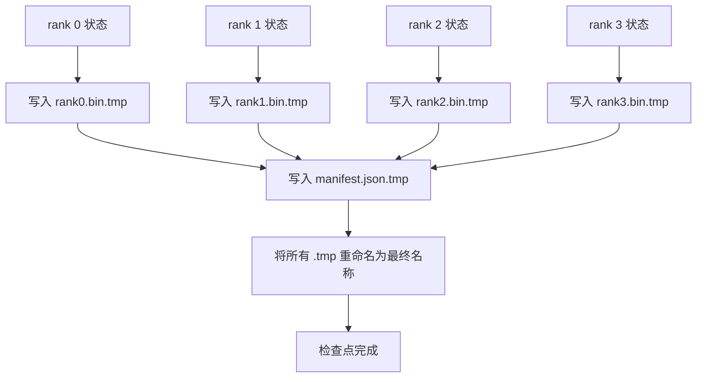

# 分片检查点与原子恢复

> 一个 700 亿参数的训练任务每隔几个小时就会被节点故障打断。检查点的格式决定了你丢失的是 30 分钟还是 30 小时。分片检查点让每个 rank 并行写入自己的分片，并通过清单（manifest）记录所有权。恢复时，每个 rank 从自己的文件加载分片，在相同的 world size 上重建状态，优化器就像什么都没发生一样继续运行。原子写入可防止未完成的检查点污染下一次恢复。

**类型：** 构建
**语言：** Python
**前置条件：** 第 19 阶段 Track C 第 42–49 课
**时间：** ~90 分钟

## 学习目标

- 将多 rank 检查点保存为每个 rank 的分片文件，外加一个清单，记录哪个 rank 拥有哪些数据。
- 使用原子写入模式（写入临时路径，然后重命名），使写入中途崩溃不会产生不完整的检查点。
- 从清单恢复，验证每个 rank 上 fp16 参数和 ZeRO 优化器状态的字节级一致性。
- 使用清单模式防御三种故障模式：world size 变化、分片数量不匹配和部分写入。

## 问题

传统检查点将所有参数和优化器状态读入 rank 0，收集后写入单个文件。对于一个 700 亿参数的模型，即有 1.1 TB 的状态数据要通过一个 rank 的网络端口传输。写入操作阻塞了所有其他 rank，因为它们空闲等待收集完成。IO 带宽受限于最慢的单 GPU 网络链路，而非聚合带宽。在实际集群中，收集再写入的步骤可能比之前的训练时间还要长，这意味着该任务每天完成的检查点不到一个。

分片检查点翻转了这一模式：每个 rank 并行地将自己的分片写入自己的文件。清单记录了哪个 rank 拥有哪个分片，这样恢复时可以将每个分片放回它原本的位置。聚合写入带宽随集群规模扩展。一个通过单个 rank 需要 4 小时写入的 1 TB 检查点，通过 64 个 rank 只需 4 分钟。此外，清单还为不兼容的恢复提供契约：world size 变化可被检测，部分写入可被检测，加载路径可以大声失败，而不是静默使用过时数据。

## 概念



### 清单模式

```json
{
  "world_size": 4,
  "step": 1234,
  "wall_clock_seconds": 4521,
  "shards": [
    {"rank": 0, "path": "rank0.bin", "sha256": "...", "param_shard_offset": 0, "param_shard_numel": 65536},
    {"rank": 1, "path": "rank1.bin", "sha256": "...", "param_shard_offset": 65536, "param_shard_numel": 65536}
  ],
  "schema_version": 1
}
```

三个字段至关重要。`world_size` 使在不同 size 上恢复时大声失败，而非静默损坏。每个分片的 `sha256` 可捕获部分写入或损坏的写入。每个分片的 `param_shard_offset` 和 `param_shard_numel` 让加载器在正确位置重建扁平参数张量。

### 原子写入

标准模式：将每个分片写入 `<名称>.tmp`，将清单写入 `manifest.json.tmp`，分别执行 fsync，然后重命名。同一文件系统内的 POSIX rename 是原子的；新文件要么完整存在，要么旧文件保持不变。最终重命名之前的崩溃会将上一个检查点保留为当前有效的检查点。没有原子写入，崩溃可能留下一个部分分片，同时清单存在并指向它，恢复时会导致优化器状态损坏。

### 模式必须防御的三种故障模式

| 故障 | 症状 | 防御 |
|------|------|------|
| World size 变化 | 在 N=8 上恢复使用来自 N=4 的清单 | 清单中 world_size 不匹配，大声失败 |
| 分片数量不匹配 | 恢复时看到的 rank*.bin 文件少于清单中的分片 | 枚举分片，验证每个都存在 |
| 部分写入 | 分片文件在刷新中途被截断 | 加载时进行 sha256 验证 |

每种防御都在早期拒绝错误加载；否则就是静默损坏，会在 100 步后损失函数变为 NaN 时才暴露出来。

### 为什么使用每 rank 文件，而不是一个大文件

通过 `O_APPEND` 并发写入一个文件在 POSIX 上对字节对齐写入可行，但实际上一个分片内的偏移跨越 MB 级区域，锁开销占据主导。每 rank 文件没有竞争，当底层文件系统是并行文件系统（Lustre、GPFS）时还能受益于条带化。生产栈（DeepSpeed、FSDP、NeMo）都因此使用每 rank 文件。

## 构建

`code/main.py` 实现了：

- `ShardManifest` 数据类，包含上述模式以及 `to_json`/`from_json`。
- `save_sharded(state_dict_per_rank, dir, step)`，使用原子化的临时-然后-重命名模式将每个 rank 的二进制状态写入其自己的文件，然后写入清单。
- `load_sharded(dir, expected_world_size)`，读取清单，验证每个分片的 sha256，并返回每个 rank 的状态字典。
- 往返测试：构建每 rank 状态，保存，加载，断言字节级相等。

运行：

```bash
python3 code/main.py
```

输出：写入 4 个分片文件及清单，然后重新加载并通过字节级相等验证。

## 生产环境中的实际模式

三种模式可让检查点足够健壮以投入生产。

**异步写入。** 生产栈在单独的线程或进程中执行检查点写入，使训练继续。屏障设在下一个检查点：在上一个保存完成之前不开始下一次保存。DeepSpeed 的 `async_io` 标志正是做此事。本课程保持写入同步以便步骤可见。

**本地快速磁盘优先，然后异步上传。** 先写入本地 NVMe（快速），然后异步上传到 S3 或 GCS。这种两层模式保持集群内检查点快速可用用于恢复，同时将持久副本发送到集群外归档。清单携带本地路径；上传清单携带远程路径。

**轮转很重要。** 生产运行保留最近 K 个检查点（通常 3-5 个），轮转删除最旧的。没有轮转，磁盘会在运行中段填满，下一次检查点失败。有了轮转，下一次保存先删除最旧的，释放空间预算。

## 使用

生产模式：

- **DeepSpeed 检查点。** `deepspeed.save_checkpoint(tag=step)` 写入每 rank 文件和一个指向当前标签的 `latest` 文件。
- **PyTorch FSDP 检查点。** `torch.distributed.checkpoint` 使用决定每 rank 布局的 `Planner` 保存分片状态。
- **NeMo。** 封装 DeepSpeed 和 FSDP，提供统一的 `save_to_checkpoint` API，添加元数据。

## 交付

第 81 课会保存端到端 DDP+ZeRO 运行的分片检查点，并在相同的 world size 上重新加载，证明恢复契约成立。

## 练习

1. 添加异步写入：在单独的线程中启动保存，让训练继续。在下一次保存完成之前阻塞下一次保存。
2. 添加 `last_5_steps` 轮转：保留最近 5 个检查点，在保存新检查点之前删除最旧的。
3. 添加仅 CRC 的快速验证路径，用于内循环重载（轮转将某个检查点变为新的活跃检查点，无需完整的 sha256）。
4. 添加跨 world size 加载：通过读取清单、拼接和重新分片，从 N=4 重新平衡到 N=8。
5. 添加上传到模拟 S3（第二个目录），并写入上传清单。防御两层存储策略。

## 关键术语

| 术语 | 常见说法 | 实际含义 |
|------|---------|---------|
| 分片检查点 | "Per-rank save" | 每个 rank 并行写入自己的分片文件 |
| 清单 | "Index" | 记录分片路径、偏移量和 sha256 的 JSON 文件 |
| 原子写入 | "tmp then rename" | 写入 .tmp 然后 POSIX rename，使崩溃时上一个文件保持有效 |
| 部分写入 | "Truncated shard" | 写入期间崩溃产生损坏的分片；sha256 可捕获 |
| 轮转 | "Keep last K" | 在写入新检查点之前删除最旧的检查点以限制磁盘使用 |

## 延伸阅读

- [DeepSpeed 检查点](https://www.deepspeed.ai/tutorials/checkpointing/)
- [PyTorch torch.distributed.checkpoint](https://pytorch.org/docs/stable/distributed.checkpoint.html)
- [POSIX rename 原子性](https://pubs.opengroup.org/onlinepubs/9699919799/functions/rename.html)
- 第 19 阶段第 78 课——此检查点旨在保存的 ZeRO 状态
- 第 19 阶段第 81 课——端到端演示对保存的状态进行往返验证
