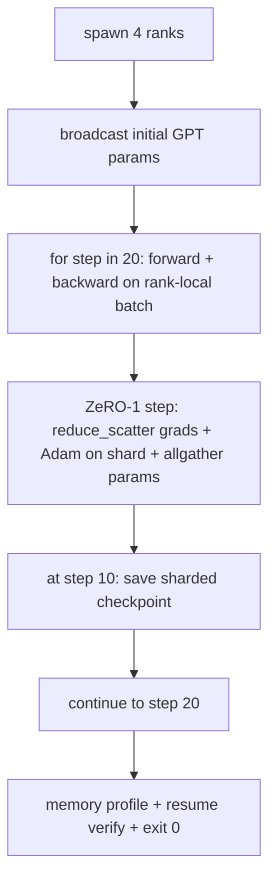

# Uçtan Uca Dağıtılmış Eğitim

> 76'dan 80'e kadar olan derslerin her biri tek parçadan oluştu. Montaj budur: gradient senkronizasyonu için DDP, optimizer durumu parçalaması için ZeRO-1 ve yarı yolda parçalanmış bir kontrol noktası ile 4 simüle edilmiş aşamada eğitilmiş küçük bir GPT. Demo 20 adımı çalıştırır, kendi kendini sonlandırır, bir kayıp eğrisi artı bir bellek profili yazdırır ve devam ettirilebilir bir kontrol noktası yazar.

**Tür:** Yapım
**Diller:** Python
**Önkoşullar:** Aşama 19 Bölüm C dersleri 42-49
**Süre:** ~90 dk

## Öğrenme Hedefleri

- DDP (ders 77) artı ZeRO-1 (ders 78) artı parçalanmış kontrol noktalarını (ders 80) tek bir eğitim döngüsünde oluşturun.
- 4 simüle edilmiş aşamada 20 adım boyunca küçük bir sentetik korpus üzerinde 2 katmanlı bir transformer dil modelini eğitin.
- Adım başına kayıp tablosu, sıra başına bellek profili ve aynı dünya boyutunda bayt eşitliğini sürdüren bir kontrol noktası bildirimi yazdırın.
- Kompozisyonu savunun: Her parça önceki derslerde bağımsız olarak test edilebilir ve bu ders onların bestelendiğini kanıtlar.

## Sorun

Kapak taşı, parçaların birbirine uyduğunun kanıtıdır. Ders 76 uygulanan kolektifler. Ders 77 onları DDP'ye sardı. Ders 78, azaltılmış_scatter ile parçalanmış optimize edici durumu. Ders 79'da boru hattı analiz edildi. Ders 80, parçalanmış bir kontrol noktasını kaydetti. Her ders kendi testiyle baş başaydı. Gerçek bir eğitim koşusu her ilkel öğeyi aynı anda kullanır; kompozisyon yanlışsa, kayıp farklılaşır, kontrol noktası devam etmeyi reddeder veya sıralama başına bellek küçülmesi gerekirken büyür.

Bu ders, uçtan uca demoyu çalıştırır ve dört değişmezi doğrular: (a) kayıp, kayan gürültü içerisinde 20 adım boyunca monoton bir şekilde azalır, (b) her sıra, her adımda aynı parametre normunu tutar, (c) sıra başına optimize edici belleği, Sıfır-1 formülü 12P/N bayta eşittir ve (d) adım 10'daki kontrol noktası, yeniden başlatma sırasında bayta eşit olarak yeniden yüklenir. Demo kendi kendine sona erer: 20 adım, tek komut, 0'dan çıkış.

## Konsept



### Mini GPT

Model bilerek küçüktür: 2 transformer blok, gömülü dim 32, 4 dikkat kafası, kelime bilgisi 64, dizi uzunluğu 16, grup 4. Birkaç bin parametre. Her kablolama kararını uygulayabilecek kadar büyüktür (çok kafalı dikkat, standart maskeli yolu çalıştırır; LayerNorm'un senkronize edilecek ağırlıkları vardır; LM kafası, kelime haznesine geri dönen ayrı bir doğrusal projeksiyondur). 4 CPU seviyesindeki 20 adımın saniyeler içinde bitmesine yetecek kadar küçük.

### Kompozisyon kuralları

| Ders parçası | Sahip olduğu şey | Döngüye ne kalıyor |
|--------------|--------------|----------------------------|
| DDP yayını | İlk parametre senkronizasyonu | Yapım zamanında bir çağrı |
| Sıfır-1 adım | Gradient senkronizasyon, ana kopya güncellemesi, parametre yayını | optimiser.step yerine adım başına bir çağrı |
| Parçalanmış kontrol noktası | Sıralama başına kalıcı durum, sha256 ile bildir | Allgather aracılığıyla toplanan durumla 0. sıraya çağrıldı |
| Eğitim döngüsü | İleri, geri, kayıp günlüğü | Yukarıdaki üçünü sırayla çağırır |

Döngü,reduce_scatter veya randevu dosyaları hakkında bilgi sahibi değildir. Sıfır ve kontrol noktası modülleri, döngünün oluşturduğu dar arayüzleri ortaya çıkarır.

### Neden yalnızca MLP değil de küçük bir GPT

77. dersteki MLP, gradient senkronizasyonunu doğrulamak için yeterliydi. Küçük bir GPT üç şey ekler: kelime bilgisi üzerinde ayrı bir LM kafası (bu derste, açıklık sağlamak için çözüldü; tam GPT genellikle kafayı token embedding'ye bağlar), kayıp olarak softmax+çapraz entropi (MSE'den daha sayısal kenar durumları) ve asimetrik bir ileri (embedding'ler sonra dikkat, ardından katman başına MLP). Kapak taşı için bir MLP'ye bağlı kalmak, kompozisyonun LayerNorm'u veya embedding katmanının dereceli şeklini doğru şekilde işleyip işlemediğini gizler.

### Kendiliğinden sonlanma, 0'dan çıkış anlamına gelir

Döngü sabit 20 adım çalıştırır ve çıkar. `while True` yok, insan müdahalesi yok, harici durumdan özgeçmiş yok. Gözetimsiz çalışır halde bırakabileceğiniz ve bittiğinde tam bir günlük bulabileceğiniz bir kapatma taşı, sistemin kablolarının doğru şekilde bağlandığını kanıtlayan bir kapatma taşıdır. Herhangi bir parça kilitlenirse demo asla geri dönmez ve test donanımı onu yakalar.

## Build It — Kendin Geliştir

`code/main.py` şunu uygular:

- `MiniGPT`: maskelenmiş öz-dikkat ve ayrı bir LM kafasına sahip 2 katmanlı transformer.
- `make_corpus(seed, total_tokens)`: deterministik sonraki-token-tahmin verileri.
- `_train_worker`: rütbe başına ortaya çıkar; init parametrelerini yayınlar, döngüyü çalıştırır, Sıfır adımını çağırır, 10. adımda parçalanmış kontrol noktasını yazar.
- `verify_resume`: ana çalıştırmadan sonra, işlemdeki 10. adımdaki kontrol noktasını yeniden yükler ve kaydedilen ana parçaların, bellek içi anlık görüntü baytı ile bayt eşleştiğini ileri sürer.
- `main`: tüm demoyu düzenler, kayıp tablosunu, bellek profilini ve doğrulama sonucunu yazdırır.

Çalıştır:

```bash
python3 code/main.py
```

Çıktı: 20 satırlık bir kayıp tablosu, sıralama başına 4 satırlık bir bellek profili, bir kontrol noktası bildirimi ve başarı üzerine bir "DEVAM ETTİ" satırı.

## Vahşi doğada üretim modelleri

Gerçek koşular için kompozisyonu üç desen tamamlıyor.

**Her K adımda bir kontrol noktası, her K dakikada bir kontrol noktası.** Adım süresi, sıra uzunluğuna ve mikro parti sayısına göre değişir. 10 dakikalık bir kontrol noktası ritmi, model boyutundan bağımsız olarak aynı hesaplamayı yakalar. Derste basitlik sağlamak amacıyla adım bazlı kullanım kullanılmaktadır; üretimde duvar saati tabanlı kullanılıyor.

**Farklılığı erken tespit edin.** Üretim çalışmaları, geriye doğru bir NaN koruması ve bir kayıp artış dedektörü ekler; kayıp bir adımda 2 kattan fazla artarsa, optimize edicinin dejenere bir duruma ilerlemesine izin vermek yerine önceki kontrol noktasına geri dönün. Dersin kayıp eğrisi düzgün olduğundan koruma kullanılmaz ancak kanca kalır.

**Bellek profilini aşamalar arasında toplayın.** Sıra başına bellek, gerçek çalıştırmalarda dereceye göre farklılık gösterir (en büyük ardışık düzen aşamasına sahip sıra daha fazla etkinleştirmeye sahiptir). Üretim, kademeler arası maksimum artı ortalamayı günlüğe kaydeder; ders, formül eşleşmelerini göstermek için sıralama başına yazdırılır.

## Use It — Hazır Araçla Uygula

Üretim modelleri:

- **DeepSpeed.** DDP + Sıfır + boru hattı + etkinleştirme kontrol noktasını tek bir yapılandırma altında birleştirir. Dersin kompozisyonu DeepSpeed'in minyatür şeklidir.
- **PyTorch FSDP.** Yerel eşdeğeri. `ShardingStrategy.SHARD_GRAD_OP` ile `FullyShardedDataParallel` Sıfır-2'dir.
- **NeMo ve Megatron-LM.** En büyük modeller için paralel tensör ekleyin; aksi halde bileşim aynı şekildedir.

## Ship It — Kullanıma Sun

Parçanın tamamı burada bitiyor. Toplam 6 ders, gerçek bir ekibin DeepSpeed'i benimsemeden önce oluşturacağı dağıtılmış eğitim alt sistemidir; soyutlamanın karamsarlığa karşı olduğu kanıtlandı ve başarısızlık modları uygulandı. Aşama 17 (altyapı ve üretim) bunu gerçek bir kümelenmeye taşıyacak yerdir.

## Egzersizler

1. Dikkat kafasının tensör paralel bölünmesini ekleyin ve kaybın tek sıralı taban çizgisiyle eşleştiğini doğrulayın. İki kademe: Sıra başına düşen kafaların yarısı, tamamı dikkat çıkışını azaltır.
2. 4 mikroparti boyunca gradient birikimini ekleyin ve gradient'nin büyük bir partinin gradient'sine eşit olduğunu kanıtlayın.
3. Eğitimi 20. adıma kadar sürdüren ve orijinal çalıştırmayla aynı nihai kaybı üreten 10. adımdan devam etme yolunu ekleyin.
4. Çalıştırmanın daha sonra görselleştirilebilmesi için JSONL'ye bir metrik dışa aktarma (kayıp, derece normu, adım süresi) ekleyin.
5. Ani bir kayıp durumunda önceki kontrol noktasına geri dönen bir NaN koruması ekleyin ve geri dönüşü uygulamak için tek adımlı LR çarpanıyla bir yükselişi zorlayın.

## Anahtar Terimler

| Dönem | İnsanlar ne diyor | Aslında ne anlama geliyor |
|------|----------------|------------------------|
| Uçtan uca | "Hepsini bağlayın" | Parça başına birim test değil, tek bir çalışma her parçayı oluşturur |
| Bellek profili | "Sıra başına GB" | Parametreler, dereceler ve optimizer durumu için her sırada tutulan baytlar |
| Sözleşmeyi devam ettir | "Kaydet ve yükle" | Bir kontrol noktasına gidiş-dönüş sonrasında sıralama başına durum baytı eşittir |
| Kendiliğinden sonlanan | "Sınırlı çalışma" | Sabit adım sayısı, tamamlandığında 0'dan çık, döngüde insan yok |

## Daha Fazla Okuma

- [DeepSpeed ​​uçtan uca eğitim eğitimi](https://www.deepspeed.ai/getting-started/)
- [PyTorch FSDP ileri düzey eğitimi](https://pytorch.org/tutorials/intermediate/FSDP_advanced_tutorial.html)
- [Megatron-LM eğitim komut dosyası referansı](https://github.com/NVIDIA/Megatron-LM)
- Aşama 19 Dersleri 76-80 - bu dersin oluşturduğu her parça
- Aşama 17 - kompozisyonun gerçek bir kümeye taşınması
