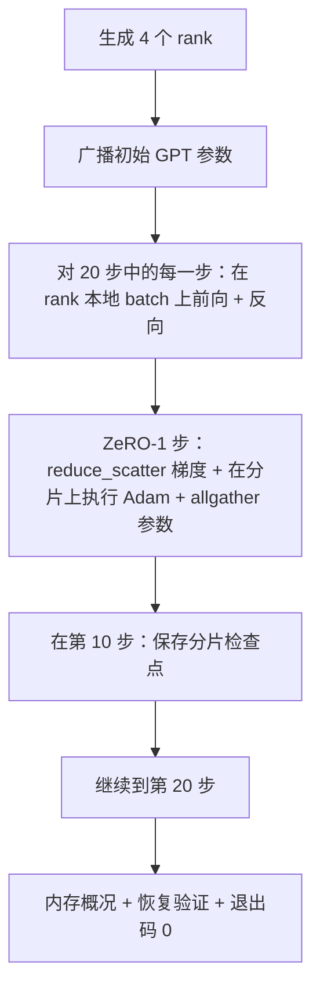

# 端到端分布式训练

> 第 76 至 80 课各自构建了一个组件。本课是整合：一个微小的 GPT，跨越 4 个模拟 rank，使用 DDP 进行梯度同步、ZeRO-1 进行优化器状态分片，并在中途保存分片检查点。演示运行 20 步，自行终止，输出损失曲线和内存概况，并写入一个可恢复的检查点。

**类型：** 构建
**语言：** Python
**前置条件：** 阶段 19 轨道 C 第 42-49 课
**时长：** ~90 分钟

## 学习目标

- 将 DDP（第 77 课）、ZeRO-1（第 78 课）和分片检查点（第 80 课）组合为一个训练循环。
- 在 4 个模拟 rank 上，对一个小型合成语料训练一个 2 层 Transformer 语言模型，共 20 步。
- 输出每步损失表、每个 rank 的内存概况，以及一个检查点清单，该清单在相同的 world size 下可恢复为字节一致的结果。
- 论证组合的正确性：每个组件在之前各课中均可独立测试，本课证明它们能够协同工作。

## 问题

毕业设计是组件能够组合在一起的有力证明。第 76 课实现了通信原语。第 77 课将其封装为 DDP。第 78 课使用 reduce_scatter 对优化器状态进行分片。第 79 课分析了流水线。第 80 课保存了分片检查点。每课独立存在，并拥有自己的测试。实际的训练运行会同时使用所有基本组件；如果组合有误，损失将发散，检查点无法恢复，或者每个 rank 的内存不减反增。

本课运行端到端演示，并验证四个不变性：(a) 在 20 步内，损失在浮点噪声范围内单调递减；(b) 每个 rank 在每一步都拥有相同的参数范数；(c) 每个 rank 的优化器内存等于 ZeRO-1 公式 12P/N 字节；(d) 第 10 步的检查点能在重启时恢复为字节一致的结果。演示自行终止：20 步，一条命令，退出码 0。

## 概念



### 微型 GPT

模型特意设计得很小：2 个 Transformer 块，嵌入维度 32，4 个注意力头，词汇量 64，序列长度 16，batch 大小 4。参数仅数千个。大到足以检验每一个连接决策（多头注意力运行标准掩码路径；LayerNorm 拥有需要同步的权重；LM 头是单独回到词汇表的线性投影）。小到 4 个 CPU rank 上的 20 步能在数秒内完成。

### 组合规则

| 课程组件 | 负责内容 | 留给循环处理的内容 |
|---------|---------|----------------|
| DDP broadcast | 初始参数同步 | 构造时调用一次 |
| ZeRO-1 step | 梯度同步、主副本更新、参数广播 | 每步调用一次，替代 optimiser.step |
| 分片检查点 | 持久化每个 rank 的状态，带 sha256 的清单 | 在 rank 0 上调用，通过 allgather 收集状态 |
| 训练循环 | 前向、反向、损失日志 | 按顺序调用以上三个组件 |

循环不关心 reduce_scatter 或 rendezvous 文件。ZeRO 和检查点模块暴露窄接口，由循环组合使用。

### 为什么用微型 GPT 而不是 MLP

第 77 课的 MLP 足以验证梯度同步。微型 GPT 增加了三项内容：词汇表上独立的 LM 头（本课中为未绑定，以便清晰；完整 GPT 通常将 LM 头与 Token 嵌入绑定）、softmax + 交叉熵作为损失函数（比 MSE 有更多数值边界情况），以及不对称的前向（每层依次为嵌入 → 注意力 → MLP）。在毕业设计中坚持使用 MLP 会掩盖组合是否正确处理 LayerNorm 或嵌入层的梯度形状。

### 自行终止意味着退出码 0

循环运行固定的 20 步后退出。没有 `while True`，无需人工干预，不依赖外部状态恢复。一个可以无人值守运行并在完成后找到完整日志的毕业设计，才是一个证明系统连接正确的毕业设计。如果任何组件死锁，演示永远不会返回，测试框架会捕获到这一点。

## 构建

`code/main.py` 实现了：

- `MiniGPT`：2 层 Transformer，带有掩码自注意力和独立的 LM 头。
- `make_corpus(seed, total_tokens)`：确定性的下一个 Token 预测数据。
- `_train_worker`：每个 rank 生成后运行；广播初始参数，运行循环，调用 ZeRO step，在第 10 步写入分片检查点。
- `verify_resume`：主运行结束后，重新加载第 10 步的检查点到进程中，并断言保存的主分片与内存中的快照逐字节匹配。
- `main`：编排整个演示，输出损失表、内存概况和验证结果。

运行方式：

```bash
python3 code/main.py
```

输出：一个 20 行的损失表、一个 4 行每 rank 内存概况、一个检查点清单，以及成功时的 "RESUME VERIFIED" 信息。

## 生产环境中的实战模式

三种模式完善了实际运行所需的组合。

**每 K 分钟检查一次，而非每 K 步。** 每步用时随序列长度和微批次数量变化。10 分钟的检查点周期能捕获相同的计算量，无论模型大小如何。本课为简单起见使用基于步数的检查点；生产环境使用基于挂钟时间的。

**尽早检测发散。** 生产运行会在反向传播后添加 NaN 保护和损失尖峰检测器；如果损失在一步内跳升超过 2 倍，则回滚到上一个检查点，而不是让优化器继续进入退化状态。本课的损失曲线平滑，因此未使用该保护，但保留了接口。

**跨 rank 聚合内存概况。** 在实际运行中，每个 rank 的内存因 rank 而异（拥有最大流水线阶段的 rank 持有更多激活值）。生产环境记录跨 rank 的最大值及平均值；本课打印每个 rank 的数据以展示公式的匹配。

## 使用

生产模式：

- **DeepSpeed。** 在一个配置下组合 DDP + ZeRO + 流水线 + 激活检查点。本课的组合是 DeepSpeed 的微型版本。
- **PyTorch FSDP。** 原生等价方案。`FullyShardedDataParallel` 配合 `ShardingStrategy.SHARD_GRAD_OP` 就是 ZeRO-2。
- **NeMo 和 Megatron-LM。** 对于最大的模型，额外添加张量并行；否则组合方式与此相同。

## 交付

完整轨道到此结束。这 6 课共同构成了一个真实团队在采用 DeepSpeed 之前会构建的分布式训练子系统；该抽象已在 gloo 上得到验证，故障模式也已得到充分演练。阶段 17（基础设施与生产）是将此方案部署到真实集群的下一站。

## 练习

1. 添加注意力头的张量并行切分，并验证损失与单 rank 基线一致。两个 rank：每个 rank 负责一半的头，对注意力输出执行 allreduce。
2. 添加跨 4 个微批次的梯度累积，并证明梯度等于一个大批次的梯度。
3. 添加一条从第 10 步恢复的路径，实际继续训练到第 20 步，并产生与原始运行相同的最终损失。
4. 添加指标导出（损失、梯度范数、每步用时）到 JSONL，以便在运行后进行可视化。
5. 添加一个 NaN 保护，在损失尖峰时回滚到上一个检查点，并通过单步学习率倍增器强制产生尖峰，以检验回滚机制。

## 关键术语

| 术语 | 通常说法 | 实际含义 |
|------|---------|---------|
| 端到端 | "全部连接起来" | 一次运行组合所有组件，而非每个组件的单元测试 |
| 内存概况 | "每个 rank 的 GB" | 每个 rank 上参数、梯度、优化器状态占用的字节数 |
| 恢复契约 | "保存和加载" | 经过检查点往返后，每个 rank 的状态逐字节一致 |
| 自行终止 | "有界运行" | 固定的步数，完成后退出码 0，无需人工介入 |

## 延伸阅读

- [DeepSpeed 端到端训练教程](https://www.deepspeed.ai/getting-started/)
- [PyTorch FSDP 高级教程](https://pytorch.org/tutorials/intermediate/FSDP_advanced_tutorial.html)
- [Megatron-LM 训练脚本参考](https://github.com/NVIDIA/Megatron-LM)
- 阶段 19 第 76-80 课——本课所组合的各个组件
- 阶段 17——将组合部署到真实集群
