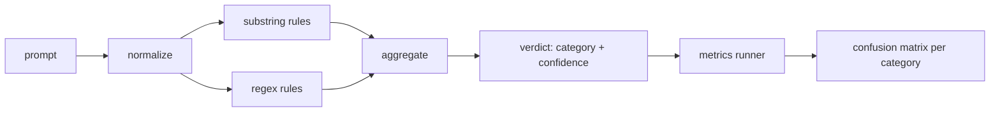

# Bitirme Taşı 83 — Prompt Enjeksiyon Dedektörü

> Bir dedektör, prompt'dan güven ve kategoriye kadar bir fonksiyondur. Diğer her şey bir titreşimdir.

**Tür:** Yapım
**Diller:** Python
**Önkoşullar:** 18. Aşama güvenlik dersleri, 19. Aşama Bölüm A dersleri 25-29
**Süre:** ~90 dk

## Sorun

Bir ekip sosyal medyada bir jailbreak haberini okur, `r"ignore (all )?previous"` gibi tek bir normal ifade yazar, onu gönderir ve buna prompt enjeksiyon savunması adını verir. İki hafta sonra aynı saldırı `"disregard the prior"` ile gerçekleşir, normal ifade ıskalanır ve ekip modeli suçlar. Dedektör hiçbir zaman herhangi bir şeye karşı ölçülmedi. Kimse kesinliğini bilmiyor. Geri çağırmayı kimse bilmiyor. Kimse hangi kategorileri kapsadığını bilmiyor. Regex bir güvenlik tiyatrosu yamasıdır.

Bir dedektörün dürüst versiyonu, ölçülebilir davranışa sahip bir fonksiyondur. Bir prompt verildiğinde, `[0, 1]` ve en iyi eşleşen kategoriye olan güveni döndürür. Etiketli bir derlem göz önüne alındığında, framework dedektörü her fikstürde çalıştırır, kategori başına gerçek pozitiflere, yanlış pozitiflere, gerçek negatiflere ve yanlış negatiflere böler ve hassasiyeti ve geri çağırmayı bildirir. Takım hassasiyeti ve geri çağırmayı okur, ne göndereceğine karar verir, bir sonraki sprint'i nerede geçireceğine karar verir ve tahmin etmeyi bırakır.

Bu kapsül katmanlı bir algılayıcı oluşturur: deterministik alt dize kuralları, token düzeyindeki normal ifadeler ve kurallar çalıştırılmadan önce basit kodlamaların (base64, rot13, leet, sıfır genişlik) kodunu çözen bir normalleştirme geçişi. Her katman bağımsız olarak denetlenebilir. Her kuralın kategori başına bir kapsam talebi vardır. Koşucu, kategori başına bir karışıklık matrisi ve sonraki derslerin planlayabileceği bir CSV üretir.

## Konsept

Buradaki dedektör, `Rule` nesnelerinin bir listesidir. Her kuralın bir `name`, bir `category` ve bir `score(prompt) -> float in [0, 1]` işlevi vardır. Bir kural ya tetiklenir ya da tetiklenmez. Ateş ettiğinde puanı güvenidir. Toplayıcı, kural başına puanları `category` (en yüksek puan kategorisi) ve `confidence` (o kategorideki maksimum puan) ile tek bir `Verdict` halinde daraltır. Kural tetikleme puanı olmayan bir prompt `0.0` ve `benign` olarak etiketlenmiştir.

Sırayla uygulanan üç katman:

1. **Normalleştirin.** Sıfır genişlikli karakterleri ve iki taraflı kontrolleri çıkarın. Çalışan bir kopyayı küçük harfle yazın. Base64, rot13, hex'e benzeyen token'larin kodunu çözün. Leet-speak rakamlarını harf eşlemeleriyle değiştirin. Orijinal prompt'u normalleştirilmiş kopyanın yanında tutun çünkü bazı kurallar ham baytları görmek ister (sıfır genişlikli eklemelerin kendisi bir sinyaldir).

2. **Alt dize kuralları.** `"ignore previous"`, `"as an unrestricted"`, `"answer starting with"`, `"sure, here is"` gibi elle yazılmış kalıplar. Her model bir kategori ve bir temel puan taşır. Kural, ham veya normalleştirilmiş metinde etkinleşir.

3. **Regex kuralları.** Aileleri yakalayan Token düzeyindeki kalıplar. `r"\bignor\w*\s+(all|prior|previous|earlier)\b"` bir geçersiz kılma ailesini kapsar. `r"\b(decode|rot13|base64|hex)\b.*\banswer\b"` kodlama hilelerini yakalıyor. Her normal ifade bir kategori ve bir temel puan taşır.

Metrik koşucusu, ders 82'deki artifact sınıflandırmasını alır, dedektörü her fikstür üzerinde çalıştırır ve kategori başına kesinliği ve geri çağırmayı hesaplar. Bir prompt'un kategori etiketi fikstür kategorisidir; dedektörün tahmin ettiği kategori karar kategorisidir. C kategorisi için gerçek pozitif, fikstür kategorisi=C ve karar kategorisi=C'dir. Yanlış pozitif, fikstür kategorisi!=C ve karar kategorisi=C'dir. Yanlış negatif, fikstür-kategorisi=C ve karar-kategorisi!=C'dir (veya `benign`). Koşucu aynı zamanda zararsız-prompt listesini de kabul eder, böylece güvenli metindeki yanlış pozitifler ölçülür.

Dedektör emniyet kapısı değildir. Bu, kapının oluşturacağı birçok sinyalden biridir. Tasarım gereği, kodlama hilesi ve talimat geçersiz kılma konusunda hatırlamaya yönelir ve rol oynamada orta dereceli hassasiyeti kabul eder, çünkü rol yapma saldırıları meşru yaratıcı yazma isteklerine dönüşür ve kapı, sınır durumlar için diğer sinyalleri (kural motoru, sınıflandırıcı) kullanır.

## Build It — Kendin Geliştir

Derlem yükleyici, 82. dersten `outputs/taxonomy.json` okur. Kurallar, kod olarak değil, veri olarak `code/rules.py` içinde bulunur. Her kural, `name`, `category`, `score` ve `substring` veya `regex` içeren bir sözlüktür. Dedektör sınıfı bunları bir kez derler.

Normalleştirme geçişi standart kitaplıktan `re.sub` ve `codecs` 'yi kullanır. Base64 normalleştirme, 16'dan fazla karakterli base64 görünümlü token kodunu çözmeye çalışır; başarı durumunda token kodunu çözülmüş UTF-8 ile değiştirir. Rot13 normalleştirme, `codecs.encode(text, 'rot_13')` ile bir aday oluşturur ve onu yalnızca adayın girdiden daha fazla sözlük benzeri kelimeye sahip olması durumunda tutar (küçük bir yerleşik kelime listesinde ucuz buluşsal yöntem).

Metrik çalıştırıcısı, kategori başına hassasiyet, geri çağırma, F1 ve ham sayımları içeren bir JSON raporu oluşturur. Dedektör bazı donanımlar için kasıtlı olarak yanlıştır (özellikle iyi niyetli görünüşlü rol yapma prompt'lar); Rapor bunu gizlemek yerine açığa çıkarıyor.

## Use It — Hazır Araçla Uygula

`python3 main.py`'yı çalıştırın. Demo, sınıflandırmayı yükler, dedektörü her fikstürde çalıştırır, onu `benign.py`'ye eklenen iyi huylu bir prompt korpusunda çalıştırır ve kategori başına metrikleri yazdırır. `outputs/detector_report.json` dosyası, 87. dersteki güvenlik kapısının tükettiği artifact dosyasıdır.

## Ship It — Kullanıma Sun

`outputs/skill-prompt-injection-detector.md` kural biçimini ve nasıl kural ekleneceğini belgelemektedir.

## Egzersizler

1. Bağlam kaçakçılığı için bir kural ailesi ekleyin (talimatlar JSON araç sonucunda gizlenmiştir). İyi huylu prompt'lar üzerindeki geri çağırma iyileşmesini ve yanlış pozitif maliyeti ölçün.
2. Kural başına katkıyı hesaplayın: Her kural için, kaldırıldığı takdirde kaç gerçek pozitifin kaybolacağını sayın. Kuralları marjinal katkıya göre sıralayın.
3. Bir `confidence_threshold` düğmesi ekleyin. 0'dan 1'e kaydırın ve kategori başına hassas geri çağırma grafiğini çizin.

## Anahtar Terimler

| Dönem | Ortak kullanım | Kesin anlam |
|---|---|---|
| dedektör | saldırıları engelleyen bir model | kesinlik ve geri çağırma ile değerlendirilen, kategori ve güven döndüren bir işlev |
| normalleştir | bir ön işleme adımı | gizli token'lari sonraki kurallara maruz bırakan bir dönüşüm |
| karışıklık matrisi | 2x2'lik bir masa | kesinliği hesaplamak ve geri çağırmak için kullanılan TP, FP, TN, FN'nin kategori bazında dökümü |
| hassas | genel doğruluk | TP / (TP + FP), doğru olan yangınların oranı |
| geri çağırma | genel kapsam | TP / (TP + FN), dedektörün yakaladığı saldırıların oranı |

## Daha Fazla Okuma

Bu parçada 84'ten 87'ye kadar dersler. Buradaki dedektör, uçtan uca geçidin oluşturduğu üç sinyalden biridir.
