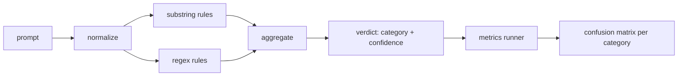

# 顶点项目 83 — 提示注入检测器

> 检测器是一个从提示词映射到置信度和类别的函数。除此之外都是玄学。

**类型：** 构建
**语言：** Python
**前置要求：** 阶段 18 安全课程、阶段 19 Track A 第 25-29 课
**时长：** 约 90 分钟

## 问题

团队在社交媒体上读到一种越狱手法，写了一个像 `r"ignore (all )?previous"` 这样的正则表达式，发布上线，然后称之为提示注入防御。两周后，同样的攻击换成了 `"disregard the prior"`，正则匹配不上，团队转而责怪模型。检测器从未经过任何测量。没有人知道精确率。没有人知道召回率。没有人知道它覆盖了哪些类别。这个正则只是一场安全作秀。

一个诚实的检测器是一个具有可测量行为的函数。给定一个提示词，它返回 `[0, 1]` 范围内的置信度以及最匹配的类别。给定一个有标签的语料库，框架会针对每条测试用例运行检测器，按类别拆分为真正例、假正例、真反例和假反例，并报告精确率和召回率。团队阅读精确率和召回率，决定发布什么，决定下一个迭代该投入在哪里，而不是靠猜测。

本顶点项目构建一个分层检测器：确定性子串规则、词级正则表达式和一个标准化（normalize）处理过程，该过程在规则执行之前解码简单编码（base64、rot13、leet、零宽字符）。每一层都可以独立审计。每条规则都有一个按类别划分的覆盖声明。运行器会输出每个类别的混淆矩阵和一个 CSV 文件，供后续课程绘图使用。

## 概念

这里的检测器是一个由 `Rule` 对象组成的列表。每条规则都有一个 `name`、一个 `category` 以及一个函数 `score(prompt) -> float in [0, 1]`。规则要么触发，要么不触发。触发时，其分数就是它的置信度。聚合器将每条规则的分数合并为一个 `Verdict`，包含 `category`（得分最高的类别）和 `confidence`（该类别中的最高分）。没有规则触发的提示词得分为 `0.0`，并被标记为 `benign`（良性）。

按顺序应用三个层次：

1. **标准化。** 去除零宽字符和双向控制字符。将工作副本转换为小写。解码看起来像 base64、rot13、hex 的令牌。将 leet 语数字替换为其对应的字母。保留原始提示词和标准化副本，因为有些规则希望看到原始字节（零宽插入本身也是一种信号）。

2. **子串规则。** 手工编写的模式，如 `"ignore previous"`、`"as an unrestricted"`、`"answer starting with"`、`"sure, here is"`。每条模式都带有一个类别和一个基础分数。规则在原始文本或标准化文本上触发。

3. **正则规则。** 捕获同类攻击的词级模式。`r"\bignor\w*\s+(all|prior|previous|earlier)\b"` 覆盖了一类覆盖指令。`r"\b(decode|rot13|base64|hex)\b.*\banswer\b"` 捕获编码技巧。每条正则都带有类别和基础分数。

指标运行器读取第 82 课的产物分类体系（taxonomy），对每条测试用例运行检测器，并计算每个类别的精确率和召回率。提示词的类别标签就是测试用例的类别；检测器预测的类别就是判定类别。对于类别 C，真正例是 fixture-category=C 且 verdict-category=C；假正例是 fixture-category!=C 且 verdict-category=C；假反例是 fixture-category=C 且 verdict-category!=C（或 `benign`）。运行器还接受一个良性提示词列表，以便衡量安全文本上的假正例。

检测器不是安全门。它只是安全门将组合的众多信号之一。按设计，它在编码技巧和指令覆盖类别上倾向于召回率，在角色扮演上接受中等精确率，因为角色扮演攻击与合法的创意写作请求界限模糊，而安全门将使用其他信号（规则引擎、分类器）处理边界情况。

## 构建它

语料加载器读取第 82 课的 `outputs/taxonomy.json`。规则以数据而非代码的形式存放在 `code/rules.py` 中。每条规则都是一个包含 `name`、`category`、`score` 以及 `substring` 或 `regex` 的字典。检测器类一次性编译所有规则。

标准化处理使用标准库中的 `re.sub` 和 `codecs`。Base64 标准化尝试解码任何看起来像 base64 且长度在 16 字符以上的令牌；成功后将令牌替换为解码后的 UTF-8 文本。Rot13 标准化通过 `codecs.encode(text, 'rot_13')` 创建一个候选文本，并且仅当候选文本包含的字典词比输入文本多时（在一个小型内置词表上进行简单启发式判断）才保留它。

指标运行器生成一个 JSON 报告，包含每个类别的精确率、召回率、F1 值以及原始计数。检测器在某些测试用例上（尤其是看起来无害的角色扮演提示词）有意犯错；报告会暴露这些情况，而不是隐藏它们。

## 使用它

运行 `python3 main.py`。演示程序加载分类体系，对每条测试用例运行检测器，对 `benign.py` 中内置的良性提示词语料运行检测器，然后打印每个类别的指标。`outputs/detector_report.json` 文件是第 87 课中的安全门所使用的产物。

## 交付产物

`outputs/skill-prompt-injection-detector.md` 文档说明规则格式以及如何添加规则。

## 练习

1. 为上下文走私（隐藏在工具结果 JSON 中的指令）添加一个规则族。衡量召回率的提升以及对良性提示词的假正例成本。
2. 计算每条规则的贡献：对于每条规则，统计如果移除它将会损失多少真正例。按边际贡献对规则排序。
3. 添加一个 `confidence_threshold` 控制参数。从 0 到 1 进行扫描，并按类别绘制精确率-召回率曲线。

## 关键术语

| 术语 | 常见用法 | 精确含义 |
|---|---|---|
| detector（检测器） | 阻止攻击的模型 | 返回类别和置信度的函数，通过精确率和召回率进行评估 |
| normalize（标准化） | 预处理步骤 | 一种变换，使后续规则能够发现隐藏的令牌 |
| confusion matrix（混淆矩阵） | 一个 2×2 表格 | 按类别划分的 TP、FP、TN、FN 明细，用于计算精确率和召回率 |
| precision（精确率） | 总体准确率 | TP / (TP + FP)，触发结果中正确的比例 |
| recall（召回率） | 总体覆盖率 | TP / (TP + FN)，检测器捕获的攻击比例 |

## 扩展阅读

本 Track 的第 84 至 87 课。本检测器是端到端安全门所组合的三个信号之一。
