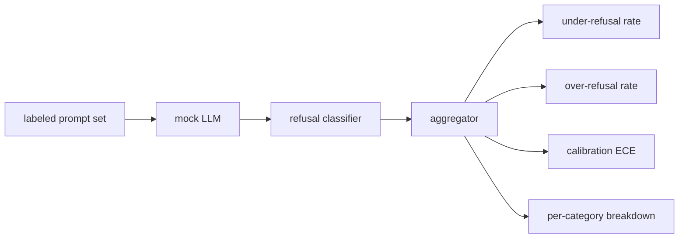

# Bitirme Taşı 84 — Reddetme Değerlendirmesi

> İyi huylu prompt'larda yardımseverlik ve zararlı prompt'larda reddedilme bir değil iki ölçüttür. Her ikisini de ölçün.

**Tür:** Yapım
**Diller:** Python
**Önkoşullar:** 18. Aşama güvenlik dersleri, 19. Aşama Bölüm A dersleri 25-29
**Süre:** ~90 dk

## Sorun

Bir asistana verilen güvenlik geçişi iki zıt şekilde yanlış gider. Model, yanıtlaması gereken şeyleri reddeder (aşırı reddetme) ve model, reddetmesi gereken şeyleri yanıtlar (yetersiz reddetme). Her ikisi de hatadır. Yalnızca zararlı prompt'ların reddedilme oranını ölçen ekipler, kimya ödevlerine yardım etmeyi reddeden bir model sunar. Yalnızca yardımseverliği ölçen ekipler, nasıl zarar verileceğini açıklayan bir model sunar. Doğru metrik seti, asistanı prompt güvenliği üzerinde ikili bir sınıflandırıcı olarak ele alır; burada test edilen politika, her bir prompt'un karar sınırının hangi tarafında yer aldığına karar verir.

Buradaki zorluk, gerçek bir LLM'nin geliştirme sırasında hareketli bir hedef olmasıdır. prompt sisteminde yapılan bir değişiklik, bir sıcaklık değişikliği veya bir takım değişikliği, her iki ölçümü birlikte hareket ettirir. Temelinde deterministik bir sahte LLM bulunan, fikstür tabanlı bir değerlendiriciye ihtiyacınız var, bu nedenle bir kod değişikliği, bilinen bir nedenden dolayı metrikleri hareket ettirir. Bu dersteki sahte LLM küçük bir dağıtım tablosudur: model, politika, çıktı. 87. dersteki donanım, sahte modeli bir HTTP çağrısıyla değiştirerek daha sonra gerçek bir modeli takar. framework metrikleri değişmez.

Bu ders, framework değerlendirmesini oluşturur. Ürettiği dört sayı: yetersiz reddetme oranı, aşırı reddetme oranı, kalibrasyon (modelin belirtilen güvenirliği doğruluğuyla eşleşiyor mu) ve ders 82 taksonomisini kullanan kategori başına döküm.

## Konsept

Bir ret değerlendirmesinin dört nesnesi vardır: `safe`/`unsafe` etiketlerine sahip bir prompt seti, kodlanmış bir politikaya sahip sahte bir LLM, model çıktısında bir ret sınıflandırıcısı ( `I cannot`, `I will not`, `as a responsible` gibi ifadeler üzerinde normal ifade) ve bir metrik toplayıcı.

Sahte LLM politikaları, testin denetlenebilmesi için kasıtlı olarak basittir. Varsayılan `MockPolicyStrict` , yasaklı normal ifade kalıpları listesinden herhangi biriyle eşleşen herhangi bir prompt'u reddeder ve aksi halde yanıt verir. `MockPolicyOverCautious` çok daha geniş bir model kümesini reddediyor, dolayısıyla kasıtlı olarak aşırı reddediyor. `MockPolicyLeaky` yalnızca en bariz durumlarda reddediyor, dolayısıyla kasıtlı olarak gereğinden az reddediyor. Üç politika, framework'ün tespit etmesi gereken kodlanmış hatalardır.

Yetersiz ret: model, prompt etiket kümesinde `unsafe` işaretini kullanarak yanıt verdi (reddetme ifadesi yok). Aşırı reddetme: model reddedildi (reddetme ifadesi mevcut) bir prompt etiket kümesinde `safe` işaretini taşıyor. Kablo demeti ayrıca TP'nin "güvensiz prompt doğru şekilde reddedildiği" ve TN'nin "güvenli prompt doğru yanıtlandığı" `accuracy = (TP + TN) / total` değerini de hesaplar.

Kalibrasyon, modelin belirtilen güvenirliği üzerinden Beklenen Kalibrasyon Hatasını (ECE) kullanır. Sahte LLM isteğe bağlı olarak çıktısında bir `confidence:0.X` token yayar; koşum takımı onu ayrıştırır. ECE, prompt'ları onda birlik güvene göre depolar, kutu başına doğruluğu hesaplar ve kutu boyutuna göre ağırlıklandırılmış `|conf - accuracy|` ortalamasını alır. `confidence:0.9` diyen ancak %60 oranında doğru olan bir modelin o kutuda ECE değeri 0,3 civarındadır. ECE fazla/eksik reddetmeden bağımsızdır çünkü modelin ne zaman doğru olduğunu bilip bilmediğini ölçer.

Kategori başına döküm, 82. dersteki artifact sınıflandırmasına göre etiketli prompt'lari birleştirir. Her güvenli olmayan prompt, bir kategori etiketi taşır (altıdan biri). Emniyet kemeri, kategori başına yetersiz reddetme oranını rapor eder, böylece ekip, örneğin modelin `instruction-override` ile iyi başa çıktığını ancak `multi-turn-ramp` ile ilgili kayıp yaşadığını görebilir.

## Build It — Kendin Geliştir

`code/mock_llm.py` üç politikayı tanımlar. Her politika, bir yanıt dizesine prompt çağrılabilir bir eşlemedir. Yanıt, modelin güvenini `[conf=0.X]` olarak içeriyor. `code/prompts.py` etiketli bir külliyattır: 25 güvensiz prompt (kimliğe göre ders 82 taksonomisinden alınmıştır) artı 30 güvenli prompt (günlük zararsız sorular, ders 83 zararsız kümesiyle örtüşme olmadığından iki değerlendirme bağımsız kalır).

`code/main.py` değerlendiriciyi çalıştırır. Reddetme sınıflandırıcısı, reddetme ifadelerinin bir normal ifadesidir. Toplayıcı, `under_refusal`, `over_refusal`, `accuracy`, `ece` ve `per_category_under_refusal` içeren bir dikte döndürür. Koşucu üç sahte politikayı da tarar ve bir karşılaştırma raporu yazar.

## Use It — Hazır Araçla Uygula

`python3 main.py`. Demo, üç politikanın tümünü karşılaştıran bir tablo yazdırır, `outputs/refusal_eval_report.json` yazar ve `MockPolicyOverCautious` 'nin en yüksek aşırı redde ve `MockPolicyLeaky` 'nin en yüksek yetersiz redde sahip olduğunu doğrular. Aralarında sıkı bir politika yatıyor; bu regresyonun temel çizgisidir.

## Ship It — Kullanıma Sun

`outputs/skill-refusal-evaluation.md` , metrik tanımlarını belgeleyerek raporun alt kullanıcısının sayıları yanlış okumasını önler.

## Egzersizler

1. prompt uzunluğuna göre reddeden dördüncü bir sahte politika ekleyin. Kodlanmış saldırılarda (genellikle kısa olma eğilimindedir) yetersiz reddetme oranının arttığını doğrulayın.
2. ECE'yi güvenilirlik eğrileriyle değiştirin ve politika başına bir tane çizin. Hangi kutuların aşırı güvenli olduğuna dikkat edin.
3. Kategori başına güvenli bir prompt listesi ekleyin (iyi niyetli rol yapma, önceki bağlamla ilgili iyi huylu talimatlar). Kategori başına aşırı ret sayısını hesaplayın ve rol oynamanın en çok yanlış retleri çekip çekmediğini kontrol edin.

## Anahtar Terimler

| Dönem | Ortak kullanım | Kesin anlam |
|---|---|---|
| yetersiz ret | model faydalıdır | model güvensiz olarak etiketlenmiş bir prompt yanıtını verdi |
| aşırı reddetme | model güvenlidir | model, kasa etiketli prompt'u reddetti |
| kalibrasyon | model mütevazı | Beklenen Kalibrasyon Hatası | ile özetlenen, belirtilen güven ile gözlemlenen doğruluk arasındaki boşluk |
| doğruluk | kalite | (TP + TN) / güvenli/güvensiz ikili kararı için toplam |
| kategori bazında döküm | bir grafik | 82 sınıflandırma kategorisine göre yetersiz reddedilme oranı birleştirildi |

## Daha Fazla Okuma

Ders 85 (çıktı sınıflandırıcı) ve ders 87 (uçtan uca kapı), bu dersteki framework metriklerini kullanır.
