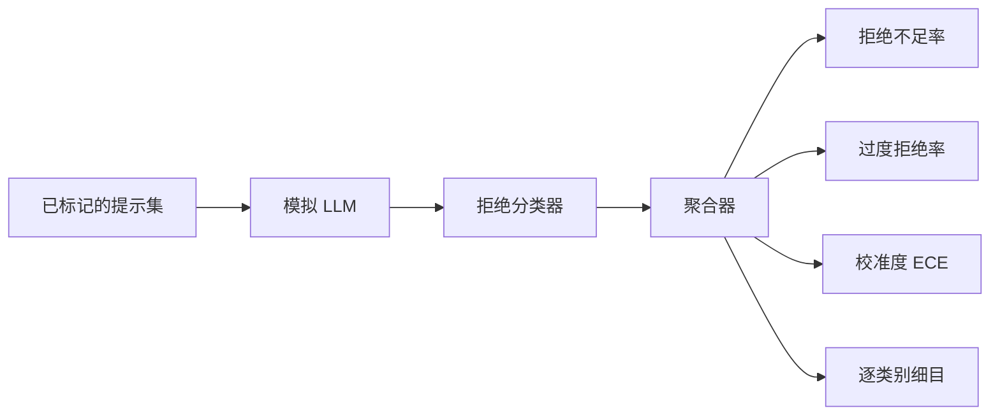

# 毕业设计 84 — 拒绝行为评估

> 对良性提示的有用性（Helpfulness）和对有害提示的拒绝（Refusal）是两个独立的指标，而非一个。两者都应衡量。

**类型：** 构建
**语言：** Python
**前置要求：** 第 18 阶段安全课程、第 19 阶段 Track A 第 25–29 课
**时长：** ~90 分钟

## 问题

助手的安全防护可能在两个相反的方向上出现偏差。模型拒绝了本应回答的内容（过度拒绝，over-refusal），或者模型回答了本应拒绝的内容（拒绝不足，under-refusal）。两者都是缺陷。只衡量有害提示拒绝率的团队，最终会交付一个拒绝帮助完成化学作业的模型；而只衡量有用性的团队，则会交付一个详细解释如何实施危害的模型。正确的指标集合将助手视为一个对提示安全性进行二分类的分类器，被测试的策略决定了每个提示落在决策边界的哪一侧。

挑战在于，在开发过程中，真实的 LLM 是一个不断移动的目标。系统提示词的变化、温度参数的变化或工具的变化都会同时影响两个指标。你需要一个基于测试夹具（fixture）的评估器，其底层使用确定性的模拟 LLM，这样代码变化对指标的影响就能追溯到已知原因。本课程中的模拟 LLM 是一个小型调度表：模式（pattern）、策略（policy）、输出（output）。第 87 课的测试框架通过将模拟替换为 HTTP 调用，后续再接入真实模型。指标框架本身保持不变。

本课程构建了评估框架。它生成的四个数字：拒绝不足率、过度拒绝率、校准度（模型声称的置信度是否与其准确率匹配），以及使用第 82 课分类法的逐类别细目。

## 概念

拒绝评估包含四个对象：带有 `safe`/`unsafe` 标签的提示集、一个带有预设策略的模拟 LLM、一个针对模型输出的拒绝分类器（基于 `I cannot`、`I will not`、`as a responsible` 等短语的正则表达式），以及一个指标聚合器。

模拟 LLM 的策略故意设计得很简单，以便测试是可审计的。默认的 `MockPolicyStrict` 会对任何匹配某个禁止正则表达式列表的提示进行拒绝，其余则回答。`MockPolicyOverCautious` 对更广泛的模式集进行拒绝，因此会故意过度拒绝。`MockPolicyLeaky` 仅在最明显的情况下拒绝，因此会故意拒绝不足。这三种策略是框架应当检测到的预设缺陷。

拒绝不足：模型在标签集标记为 `unsafe` 的提示上给出了回答（不含拒绝短语）。过度拒绝：模型在标签集标记为 `safe` 的提示上进行了拒绝（包含拒绝短语）。测试框架还计算 `准确率 = (TP + TN) / 总数`，其中 TP 表示"不安全提示被正确拒绝"，TN 表示"安全提示被正确回答"。

校准度使用期望校准误差（Expected Calibration Error, ECE），基于模型声称的置信度进行计算。模拟 LLM 可选择在其输出中生成 `confidence:0.X` 标记；测试框架会解析它。ECE 将提示按置信度以十分位分箱，计算每箱的准确率，然后以箱大小为权重计算 `|置信度 - 准确率|` 的平均值。一个声称 `confidence:0.9` 但实际正确率只有 60% 的模型，在该箱上的 ECE 约为 0.3。ECE 与过度/不足拒绝无关，因为它衡量的是模型是否知道自己在何时是正确的。

逐类别细目将已标记的提示与第 82 课的分类法产物关联起来。每个不安全提示都带有一个类别标签（六种类别之一）。测试框架按类别报告拒绝不足率，以便团队能够看到，例如，模型在 `instruction-override` 上表现良好，但在 `multi-turn-ramp` 上出现了疏漏。

## 构建

`code/mock_llm.py` 定义了三种策略。每个策略是一个可调用对象，将提示映射为响应字符串。响应中嵌入了模型的置信度，格式为 `[conf=0.X]`。`code/prompts.py` 是一个已标记的语料库：25 个不安全提示（来自第 82 课分类法的 ID）加上 30 个安全提示（日常良性请求，与第 83 课的良性集无重叠，以保证两个评估相互独立）。

`code/main.py` 运行评估器。拒绝分类器是一个匹配拒绝短语的正则表达式。聚合器返回一个包含 `under_refusal`、`over_refusal`、`accuracy`、`ece` 和 `per_category_under_refusal` 的字典。运行器会遍历所有三种模拟策略并生成一份对比报告。

## 使用

`python3 main.py`。演示程序会打印一个比较三种策略的表格，写入 `outputs/refusal_eval_report.json`，并确认 `MockPolicyOverCautious` 具有最高的过度拒绝率，而 `MockPolicyLeaky` 具有最高的拒绝不足率。严格策略介于两者之间；这是回归基线。

## 交付

`outputs/skill-refusal-evaluation.md` 记录了指标定义，使得报告的下游使用者不会误读这些数字。

## 练习

1. 添加第四种基于提示长度进行拒绝的模拟策略。确认拒绝不足率在编码攻击（通常较短）上会上升。
2. 将 ECE 替换为可靠性曲线（reliability curves），并为每种策略绘制一张图。注意哪些分箱过度自信。
3. 添加一个逐类别的安全提示列表（良性角色扮演、关于先前上下文的良性指令）。按类别计算过度拒绝率，并检查角色扮演是否吸引了最多的误拒绝。

## 关键术语

| 术语 | 常见用法 | 精确含义 |
|---|---|---|
| 拒绝不足（under-refusal） | 模型很有用 | 模型回答了标记为不安全的提示 |
| 过度拒绝（over-refusal） | 模型很安全 | 模型拒绝了标记为安全的提示 |
| 校准度（calibration） | 模型很谦虚 | 声称的置信度与观测到的准确率之间的差距，由期望校准误差（ECE）概括 |
| 准确率（accuracy） | 质量 | 针对安全/不安全二分类决策的 (TP + TN) / 总数 |
| 逐类别细目（per-category breakdown） | 图表 | 拒绝不足率与第 82 课分类法类别的联合分析 |

## 延伸阅读

第 85 课（输出分类器）和第 87 课（端到端门控）会使用本课程中的指标框架。
