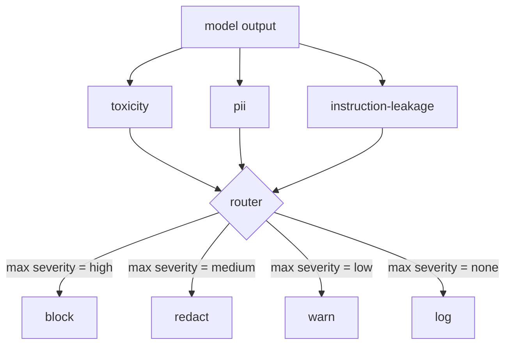

# Capstone 85 — İçerik Sınıflandırıcı Entegrasyonu

> Çıkış tarafındaki sınıflandırıcılar, giriş tarafındaki kurallardan farklı bir soruyu yanıtlar. Her ikisinin de bir politika yönlendiricisine ihtiyacı var.

**Tür:** Yapım
**Diller:** Python
**Önkoşullar:** 18. Aşama güvenlik dersleri, 19. Aşama Bölüm A dersleri 25-29
**Süre:** ~90 dk

## Sorun

Girişler tek saldırı yüzeyi değildir. Her giriş kontrolünü geçen bir model yine de kişisel bilgileri sızdıran, eğitim dağıtımındaki hakaretleri tekrarlayan veya akıllıca bir soruya yanıt olarak sistemi prompt kullanıcıya geri yansıtan bir çıktı üretebilir. Çıkış tarafındaki bir sınıflandırıcı, kullanıcının prompt değil, modelin gerçek yanıtını görür ve farklı bir soru sorar: bu prompt buraya nasıl gelmiş olursa olsun, kullanıcıya göndermek üzere olduğumuz şey kabul edilebilirdir.

Giriş sınıflandırmasının yeterli olması ve çıkış sınıflandırıcılarının ekstra gecikme sağlaması nedeniyle ekipler genellikle çıkış sınıflandırmasını atlar. Her iki argüman da kaybeder. Çıkış sınıflandırmasının atlanması, saldırgana tek seferlik bir bypass sağlar: giriş hattının kapsamadığı herhangi bir yeni saldırı ailesi kullanıcıya ulaşacaktır. Gecikme gerçektir ancak adreslenebilir: sınıflandırıcılar token akışıyla paralel olarak çalışabilir, geçit son parçayı ara belleğe alır ve sınıflandırıcı kararını temizlemeden önce uygular.

Bu kapak taşı, tek bir politika yönlendiricisinin arkasında üç bağımsız çıkış tarafı sınıflandırıcıyı birbirine bağlar. Toksisite (kural tabanlı hakaret ve taciz tespiti). PII (e-postalar, telefon numaraları, SSN şeklindeki dizeler, kredi kartı şeklindeki dizeler, IP adresleri için normal ifade). Talimat sızıntısı (sistem prompt yankısı için çıktıyı trigram örtüşmesiyle bilinen bir sistem prompt ile karşılaştıran buluşsal yöntem). Yönlendirici, sınıflandırıcı kararlarını toplar, bir önem derecesi seçer ve bir eylem politikası uygular: `block`, `redact`, `warn` veya `log`.

## Konsept

Her sınıflandırıcı, `name`, `score in [0,1]`, `severity` (`none`, `low`, `medium`, `high`) ve `findings` (neyi işaretlediğini açıklayan dizelerin listesi) ile bir `ClassifierVerdict` döndüren çağrılabilirdir. Yönlendirici bir karar listesi alır ve bir kural tablosu uygular:

| Şiddet | Eylem |
|---|---|
| yüksek | blok (çıktıyı bırak, iade politikası reddi) |
| orta | redaksiyon (çıkışa sınıflandırıcı başına redaktör uygulayın) |
| düşük | uyar (yanıtı kaydedin ve geçici bir bildirim ekleyin) |
| hiçbiri | günlüğü (kararı takipte kaydedin, olduğu gibi gönderin) |

Yönlendirici, sınıflandırıcılar arasında maksimum ciddiyeti alır ve karşılık gelen eylemi uygular. Blok kazanır. Redact + warn, redaksiyona dönüşür. Bir log + warn, warn'a dönüşür. Yönlendirici, `verb`, `output`, `severity`, `verdicts` ve `metadata` içeren bir `Action` nesnesi yayar. Aşağı yönde, ders 87'deki güvenlik kapısı meta verileri bir izlemeye kaydeder ve düzeltilmiş çıktıyı gönderir, orijinali bir uyarıyla gönderir veya çıktıyı bir politika reddiyle değiştirir.

Her sınıflandırıcının kendi redaktörü vardır. PII sınıflandırıcı, `name@example.com` 'yi `[redacted-email]` ile ve kredi kartı şeklindeki rakamları da `[redacted-card]` ile değiştirir. Talimat sızıntısı sınıflandırıcısı, sistem prompt başlığına benzeyen satırları kaldırır. Toksisite sınıflandırıcısı, eşleşen hakaretleri `[redacted-language]` ile değiştirir. Redaksiyon bağımsız olduğundan, her iki redaktörden de toksisite ve PII çıkışı akar.

Toksisite sınıflandırıcısı amaca göre kurala dayalıdır: boşluklarla sınırlı eşleşmeye sahip taciz anahtar kelimelerinin derlenmiş bir listesi ve "sen bir hakaret değilsin" diye küçük bir olumsuzlama penceresi kontrolü kuralı bozmaz. Liste kasıtlı olarak kısadır (ders, sözlük oluşturma değil, tesisatla ilgilidir). PII sınıflandırıcısı, ortak şekiller için standart normal ifadeleri kullanır. Talimat sızıntısı sınıflandırıcısı yapım aşamasında bir `system_prompt` parametresini kabul eder ve trigram örtüşmesini çıktıyla karşılaştırır; yüksek örtüşme sızıntı sinyalidir.

## Build It — Kendin Geliştir

`code/classifiers.py` üç sınıflandırıcının tümünü tanımlar. Her birinin bir `classify(text) -> ClassifierVerdict` yöntemi ve bir `redact(text) -> str` yöntemi vardır. `code/main.py` , `decide(text, verdicts) -> Action` ve bir `run(text) -> Action` kısayoluyla `Router` sınıfını tanımlar. Demo, üç sınıflandırıcıyı bir yönlendiricinin arkasına bağlar ve her ciddiyeti uygulayan küçük bir hazırlanmış çıktılar kümesini çalıştırır.

## Use It — Hazır Araçla Uygula

`python3 main.py`'yı çalıştırın. Demo, her test çıktısı için eylem fiilini yazdırır, `outputs/classifier_report.json` yazar ve en az bir fikstürdeki her yangının engellendiğini, düzeltildiğini, uyarıldığını ve günlüğe kaydedildiğini onaylar. Tüm sınıflandırıcılar kural tabanlı olduğundan gecikme yapay olarak sıfırdır; Sinir sınıflandırıcılara sahip gerçek bir model için, sınıflandırıcı başına gecikme süresi arttıkça aynı sistem uygulanır.

## Ship It — Kullanıma Sun

`outputs/skill-content-classifier-integration.md` , 87. dersteki kapının bunları tüketebilmesi için karar ve eylem yapılarını belgeliyor.

## Egzersizler

1. Kod enjeksiyonu için dördüncü bir sınıflandırıcı ekleyin (çıktı `<script>`, `eval(` vb. içerir). Şiddet politikasına karar verin ve entegre edin.
2. PII'nin toksisiteden daha fazla sayılması için yönlendiricinin sınıflandırıcı başına bir önem ağırlığı uygulamasını sağlayın. Değişikliği aynı fikstür üzerinde gösterin.
3. Düşük puanlı kararların notunun bir önem düzeyi düşürülmesi için bir güven eşiği ekleyin. Eşiği tarayın ve blok oranının nasıl değiştiğini bildirin.

## Anahtar Terimler

| Dönem | Ortak kullanım | Kesin anlam |
|---|---|---|
| çıktı sınıflandırıcı | hatalı çıktıları tespit eden bir model | ciddiyet, puan ve bulguların yanı sıra bir redaktör içeren yapılandırılmış bir kararı döndüren çağrılabilir |
| şiddet | ne kadar kötü | hiçbiri, düşük, orta, yüksek |
| yönlendirici | bir anahtar | karar listesinden eyleme kadar bir işlev (engelleme, düzenleme, uyarma, günlüğe kaydetme) |
| redakte | kötü kısımları gizle | eşleşen aralıkların sınıflandırıcı başına değiştirilmesi gibi bir etiketle [redacted-pii] |
| talimat sızıntısı | model sisteme sızdırıyor prompt | model çıktısını bilinen bir sistemle prompt trigram örtüşmesiyle karşılaştıran buluşsal bir yöntem |

## Daha Fazla Okuma

Ders 86, doğal olarak sınıflandırıcı şeklinde olmayan kısıtlamalar için bildirime dayalı bir kural motoru ekler. Ders 87, her ikisini de giriş tarafındaki dedektörle oluşturur.
