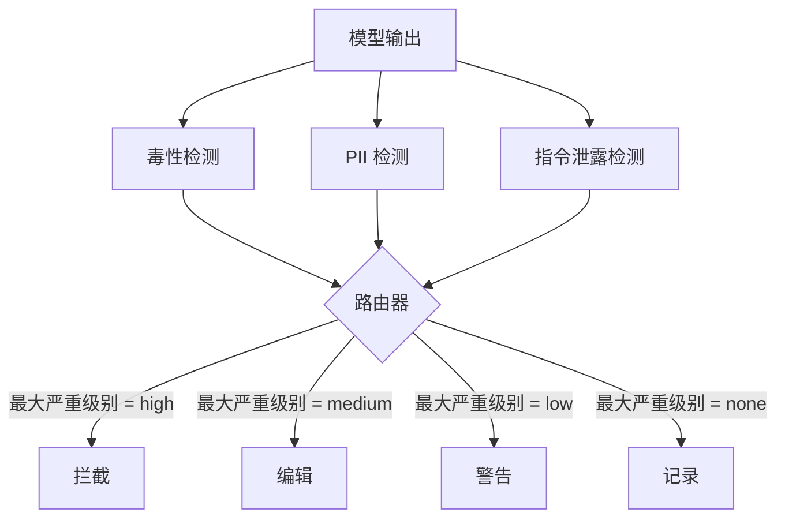

# 实训项目 85 — 内容分类器集成

> 输出侧的分类器所回答的问题与输入侧的规则不同。两者都需要一个策略路由器。

**类型：** 构建  
**语言：** Python  
**前置要求：** 第 18 阶段安全课程，第 19 阶段 Track A 第 25-29 课  
**时长：** ~90 分钟

## 问题

输入并非唯一的攻击面。一个通过了所有输入检查的模型，仍然可能产生泄露 PII、重复训练数据中的歧视性言论，或者通过巧妙的问题将系统提示回显给用户的输出。输出侧分类器看到的是模型的实际响应，而非用户的提示，它问的是一个不同的问题：无论这个提示是如何到达这里的，我们即将发送给用户的内容是否可以接受。

团队常常跳过输出分类，因为输入分类似乎已经足够，而且输出分类器会引入额外延迟。这两个论点都不成立。跳过输出分类等同于给攻击者一个一击绕过的机会：任何输入管道未覆盖的新型攻击手段都将直达用户。延迟确实存在，但可以解决：分类器可以与令牌流并行运行，由门控缓冲最后一块内容，在刷出之前应用分类器判决。

本实训项目将三个独立的输出侧分类器置于一个统一策略路由器之后。毒性检测（基于规则的歧视性言论和骚扰检测）。PII（电子邮件、电话号码、类社保号字符串、类信用卡号字符串、IP 地址的正则表达式）。指令泄露（一种用于检测系统提示回显的启发式方法，通过三元组重叠度将输出与已知系统提示进行比较）。路由器收集分类器判决结果，确定严重级别，并应用相应的操作策略：`block`（拦截）、`redact`（编辑）、`warn`（警告）或 `log`（记录）。

## 概念

每个分类器是一个可调用对象，返回一个 `ClassifierVerdict`，包含 `name`、`score in [0,1]`、`severity`（`none`、`low`、`medium`、`high`）和 `findings`（描述其标记内容的字符串列表）。路由器接收判决结果列表并应用规则表：

| 严重级别 | 操作 |
|---|---|
| high | block（丢弃输出，返回策略拒绝消息） |
| medium | redact（对输出应用各分类器的编辑器） |
| low | warn（记录并在响应中附加一条软性提示） |
| none | log（将判决记录到追踪中，原样发送） |

路由器取所有分类器中最高严重级别，并执行对应操作。拦截优先。编辑 + 警告变为编辑。记录 + 警告变为警告。路由器输出一个 `Action` 对象，包含 `verb`、`output`、`severity`、`verdicts` 和 `metadata`。下游的第 87 课安全门控会将元数据记录到追踪中，然后发送编辑后的输出、附带警告发送原始输出，或将输出替换为策略拒绝消息。

每个分类器拥有自己的编辑器。PII 分类器将 `name@example.com` 替换为 `[redacted-email]`，将类信用卡数字替换为 `[redacted-card]`。指令泄露分类器移除看起来像系统提示头部的行。毒性分类器将匹配到的歧视性言论替换为 `[redacted-language]`。编辑是相互独立的，因此同时触发毒性和 PII 的输出会依次通过两个编辑器。

毒性分类器特意采用基于规则的方式：一个经过整理的骚扰关键词列表，使用空白字符边界匹配，并带有一个小范围的否定词窗口检查，从而避免"你不是某个歧视词"这样的语句触发规则。该列表故意保持简短（本课的重点在于系统集成，而非词典构建）。PII 分类器对常见格式使用标准正则表达式。指令泄露分类器在构造时接受一个 `system_prompt` 参数，通过三元组重叠度与输出进行比较；高重叠度即为泄露信号。

## 构建

`code/classifiers.py` 定义了全部三个分类器。每个分类器包含 `classify(text) -> ClassifierVerdict` 方法和 `redact(text) -> str` 方法。`code/main.py` 定义了 `Router` 类，包含 `decide(text, verdicts) -> Action` 方法和 `run(text) -> Action` 快捷方法。演示程序将三个分类器接入一个路由器，并对一组精心构造的输出样本进行测试，覆盖每种严重级别。

## 使用

运行 `python3 main.py`。演示程序会打印每个测试输出的操作动词，写入 `outputs/classifier_report.json`，并确认拦截、编辑、警告和记录各自至少在一个测试样本上触发。由于所有分类器均基于规则，延迟为零；对于使用神经分类器的真实模型，在增加各分类器延迟之后，相同的系统架构依然适用。

## 交付

`outputs/skill-content-classifier-integration.md` 文档记录了判决和操作的结构，以便第 87 课的门控能够消费这些数据。

## 练习

1. 添加第四个用于代码注入的分类器（输出包含 `<script>`、`eval(` 等）。确定其严重级别策略并将其集成。
2. 让路由器按分类器应用不同的严重级别权重，使 PII 的权重高于毒性。在同一批测试样本上演示变更效果。
3. 添加一个置信度阈值，使低分数判决降低一个严重级别。遍历阈值并报告拦截率如何变化。

## 关键术语

| 术语 | 常见用法 | 精确含义 |
|---|---|---|
| output classifier | 检测不良输出的模型 | 一个可调用对象，返回带有严重级别、分数和发现项的结构化判决，并附带一个编辑器 |
| severity | 严重程度 | none、low、medium、high 之一 |
| router | 一个开关 | 一个从判决列表到操作（block、redact、warn、log）的函数 |
| redact | 隐藏不良部分 | 按分类器将匹配区间替换为诸如 [redacted-pii] 之类的标签 |
| instruction leakage | 模型泄露系统提示 | 一种启发式方法，通过三元组重叠度比较模型输出与已知系统提示 |

## 延伸阅读

第 86 课为那些天然不适合分类器形态的约束添加了一个声明式规则引擎。第 87 课将两者与输入侧检测器组合在一起。
