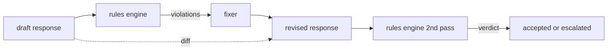

# Bitirme Taşı 86 — Anayasal Kurallar Motoru

> Kural bir isim, bir yüklem ve bir açıklamadır. Bu üçünden birinin eksik olduğu herhangi bir şey bir kural değil, bir titreşimdir.

**Tür:** Yapım
**Diller:** Python, YAML
**Önkoşullar:** 18. Aşama güvenlik dersleri, 19. Aşama Bölüm A dersleri 25-29
**Süre:** ~90 dk

## Sorun

Sınıflandırıcılar fark edilebilir hataları kapsar. Kural motorları sözleşmeye bağlı olanları kapsar. Kodlama asistanı yazan bir ekip, "kod içeren her yanıtın ya çalıştırılabilir bir blokla ya da belirtilen bir varsayımla bitmesi gerekir" gibi bir kısıtlama ister. Müşteri destek botu çalıştıran bir ekip, "her reddetmenin bir sonraki adımı sunması gerektiğini" istiyor. Bu kısıtlamalar doğal sınıflandırıcı hedefleri değildir. Bunlar yanıtın, konuşmanın ve sistem politikasının yüklemleridir ve mühendis olmayan biri tarafından okunabilmesi gerekir.

Dürüst temsil beyan niteliğinde bir dosyadır. Bir anayasa, YAML'de kodun yanında, sürüm kontrolünde ve ayrı bir inceleme süreciyle birlikte yaşar. Her kuralın bir `name`, bir `predicate`, bir `severity` ve bir `explanation` şablonu vardır. Motor dosyayı yükler, her kuralı aday çıktıya göre değerlendirir ve tetiklenen kural başına yapılandırılmış bir `Violation` döndürür. Bu kapsüldeki kural motoru `all_of`, `any_of` ve `not_` ile yüklemler oluşturur; böylece tek bir kural "yanıt kod içeriyorsa, çalıştırılabilir bir blokla bitmeli VE yalnızca dahili bir kitaplığa referans vermemelidir." ifadesini ifade edebilir.

Dersin diğer yarısı ise tekrardır. Yalnızca bloklayan bir kural motoru yarı yapılandırılmıştır. Düzeltme öneren bir kural motoru operasyonel açıdan faydalıdır: Asistan bir yanıt taslağı hazırlar, motor ihlalleri işaretler, tamirci revize edilmiş bir yanıt üretir ve motor, revizyonun kuralları karşıladığını doğrular. Ders, taslak ile revize edilen arasında minimum düzeyde bir düzeltici (kural başına normal ifade değişimi) ve yapılandırılmış bir fark (satır satır eklemeler, kaldırmalar, düzenlemeler) sunar.

## Konsept



Bir kuralın şekli vardır

```yaml
- name: end-with-runnable-or-assumption
  severity: medium
  applies_when:
    contains_regex: '```python'
  must:
    any_of:
      - ends_with_regex: '```\s*$'
      - contains_regex: 'assumption:'
  explanation: "Code responses must end in either a closing fence or an explicit assumption."
  fix:
    append_if_missing: "\n\nAssumption: example inputs are valid."
```

Yüklemler atomiktir: `contains_regex`, `not_contains_regex`, `ends_with_regex`, `starts_with_regex`, `max_words`, `min_words`. Kompozisyonlar `all_of`, `any_of`, `not_`'dir. Motor önce `applies_when` 'yi değerlendirir; kural geçerli değilse ihlal `not_applicable` olarak kaydedilir. Aksi takdirde motor `must` 'yi değerlendirir ve `pass` veya `violation` üretir.

Önem dereceleri `low`, `medium`, `high` olup, ders 85'i yansıtır. Aşağı yöndeki kapı (ders 87), bir `high` kural ihlalini, bir `high` sınıflandırıcı kararıyla aynı şekilde ele alır: blok.

Düzeltici, bildirimsel işlemlerin bir listesidir: `append_if_missing`, `prepend_if_missing`, `replace_regex`. Her işlem, bir kuralı ada göre bir dönüşümle eşler. Düzeltici kasıtlı olarak yerel düzenlemelerle sınırlıdır; yapısal yeniden yazmalar, burada ele alınmayan ayrı bir reddetme ve yardım katmanına aittir.

Fark orijinal ve revize edilmiş olana göre hesaplanır. `op` (ekle, kaldır, düzenle) ve ilgili metni içeren `Change` kayıtların listesidir. Aşağı yöndeki kapı, farkı günlüğe kaydedebilir, böylece bir insan incelemeci, tamircinin zaman içindeki davranışını denetler.

## Build It — Kendin Geliştir

`code/rules.yml` anayasayı elinde tutuyor. `code/main.py` 'deki yükleyici ya bir YAML dosyasını (PyYAML mevcut olduğunda) ya da bir JSON dosyasını (yerleşik) kabul eder. Ders, ders testlerinin her iki kod yoluyla ayrıştırdığı bir `rules.yml` gönderir. `code/main.py` , `Engine` ve `Fixer` sınıflarını ve bir `diff` fonksiyonunu tanımlar. Kompozisyonlar, `any_of` üzerinde kısa devre yapılarak yinelemeli olarak değerlendirilir.

Gönderildiği şekliyle anayasa:

- `no-empty-refusal` (orta) - ret, bir öneriyi veya yönlendirmeyi içermelidir
- `end-with-runnable-or-assumption` (orta) - kod yanıtları temiz bir şekilde kapatılmalıdır
- `no-pii-in-examples` (yüksek) - örnek veriler e-posta veya telefon şekilleri içermemelidir
- `cite-when-asserting-fact` (düşük) - "Göre göre" ile başlayan satırlar parantez içinde alıntı içermelidir
- `no-internal-library-leak` (yüksek) - `internal-only` ve `policybot-internal` kelimeleri çıktıda görünmemelidir
- `bounded-length` (düşük) - yanıtlar 800 kelimeyi geçmemelidir

## Use It — Hazır Araçla Uygula

`python3 main.py`. Demo, motor aracılığıyla üç taslak yanıtı çalıştırır, ihlalleri yazdırır, düzelticiyi çalıştırır, farkı yazdırır ve `outputs/rules_report.json` yazar. Bir fikstürün geçerli olmayan bir kuralı var (taslakta kod bloğu yok) ve raporda bu kural için `not_applicable` gösteriliyor, böylece ekip motorun bunu açıkça değerlendirdiğini görüyor.

## Ship It — Kullanıma Sun

`outputs/skill-constitutional-rules-engine.md` kural dilbilgisini ve düzeltici işlemlerini belgelemektedir.

## Egzersizler

1. prompt güvenlikten bahsettiğinde her yanıtın "Bu acilse" ifadesini içermesini gerektiren bir kural ekleyin. Kompozisyon kullanın.
2. Regex sabitleyiciyi, adlandırılmış yuvaları alan bir şablonlama sabitleyiciyle değiştirin. Yeni tasarım kapsamında yeniden yazılan bir kuralı gösterin.
3. Bir taslak kümesi göz önüne alındığında, ekibin hangi kuralın aşırı ateşlendiğini görebilmesi için kural başına ihlal oranını döndüren bir ölçüm uç noktası ekleyin.

## Anahtar Terimler

| Dönem | Ortak kullanım | Kesin anlam |
|---|---|---|
| anayasa | belirsiz bir politika belgesi | yüklemler, önem dereceleri ve açıklamalar içeren bir YAML kuralları dosyası |
| yüklem | çek | all_of/any_of/not_ aracılığıyla metinden bool'a, atomik veya oluşturulmuş çağrılabilir |
| ihlal | başarısızlık | kural adı, önem derecesi, açıklama ve eşleşen yayılımı içeren yapılandırılmış bir kayıt |
| sabitleyici | bir modelin ince ayarı | revize edilmiş kural başına deterministik bir dönüşüm eşleme taslağı |
| fark | bir dize karşılaştırması | taslak ve revize edilmiş arasındaki ekleme, kaldırma ve düzenleme işlemlerinin yapılandırılmış bir listesi |

## Daha Fazla Okuma

Ders 87, giriş tarafı dedektörü ve çıkış tarafı sınıflandırıcısı ile bu motoru tek bir emniyet kapısı halinde birleştirir.
