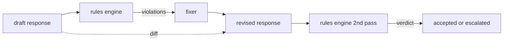

# Capstone 86 — 宪法规则引擎

> 一条规则由名称、谓词和解释组成。缺少其中任何一项的都只是感觉，而不是规则。

**类型：** 构建
**语言：** Python, YAML
**前置条件：** 第 18 阶段安全课程，第 19 阶段 Track A 第 25-29 课
**时间：** ~90 分钟

## 问题

分类器覆盖的是可识别的失败模式。规则引擎覆盖的是契约性的约束。一个编写编码助手的团队希望有这样的约束："每个包含代码的响应必须要么以可运行代码块结尾，要么以明确的假设结尾。"一个运行客服机器人的团队希望"每次拒绝都必须提供下一步建议。"这些约束并非天然的分类器目标。它们是对响应、对话和系统策略的谓词判断，并且需要非工程师也能阅读。

最诚实的表示形式是声明式文件。宪法以 YAML 形式与代码共存于版本控制中，并配有独立的审查流程。每条规则包含 `name`（名称）、`predicate`（谓词）、`severity`（严重级别）和 `explanation`（解释）模板。引擎加载该文件，针对候选输出评估每条规则，并为每条触发的规则返回结构化的 `Violation`（违规记录）。本 Capstone 中的规则引擎通过 `all_of`、`any_of` 和 `not_` 组合谓词，使得单条规则可以表达"如果响应包含代码，则必须同时以可运行代码块结尾且不得引用内部专用库"。

本课程的另一部分是修订。一个只能拦截的规则引擎只完成了一半。一个能够提出修复方案的规则引擎在操作层面更有用：助手起草响应，引擎标记违规，修复器生成修订后的响应，引擎确认修订满足规则。本课程附带一个最小化的修复器（按规则进行正则替换）以及草稿与修订版之间的结构化差异（逐行的新增、删除和编辑）。

## 概念



一条规则的结构如下：

```yaml
- name: end-with-runnable-or-assumption
  severity: medium
  applies_when:
    contains_regex: '```python'
  must:
    any_of:
      - ends_with_regex: '```\s*$'
      - contains_regex: 'assumption:'
  explanation: "包含代码的响应必须以闭合围栏或明确的假设结尾。"
  fix:
    append_if_missing: "\n\nAssumption: example inputs are valid."
```

谓词是原子性的：`contains_regex`、`not_contains_regex`、`ends_with_regex`、`starts_with_regex`、`max_words`、`min_words`。组合谓词包括 `all_of`、`any_of`、`not_`。引擎首先评估 `applies_when`；如果规则不适用，违规记录为 `not_applicable`。否则，引擎评估 `must` 并产生 `pass` 或 `violation` 结果。

严重级别包括 `low`（低）、`medium`（中）、`high`（高），与第 85 课保持一致。下游门控（第 87 课）将 `high` 级别的规则违规与 `high` 级别的分类器判定同等对待：拦截。

修复器是一组声明式操作：`append_if_missing`、`prepend_if_missing`、`replace_regex`。每个操作按规则名称映射到一个转换。修复器有意限制为局部编辑；结构性重写属于单独的拒绝与帮助层，不在本课程范围内。

差异是针对原始版本和修订版本计算得出的。它是一组 `Change` 记录，包含 `op`（操作类型：新增、删除、编辑）及相关文本。下游门控可以记录差异，以便人工审核员随时间审计修复器的行为。

## 构建它

`code/rules.yml` 保存宪法内容。`code/main.py` 中的加载器接受 YAML 文件（当 PyYAML 可用时）或 JSON 文件（内置支持）。本课程附带一个 `rules.yml`，课程测试通过两种代码路径解析它。`code/main.py` 定义了 `Engine` 和 `Fixer` 类以及一个 `diff` 函数。组合谓词通过递归求值，并在 `any_of` 上实现短路求值。

随附的宪法包括：

- `no-empty-refusal`（中）- 拒绝必须包含建议或引导
- `end-with-runnable-or-assumption`（中）- 包含代码的响应必须干净地收尾
- `no-pii-in-examples`（高）- 示例数据不得包含电子邮件或电话号码格式
- `cite-when-asserting-fact`（低）- 以"According to"开头的行必须包含括号引用
- `no-internal-library-leak`（高）- 输出中不得出现 `internal-only` 和 `policybot-internal` 词汇
- `bounded-length`（低）- 响应不得超过 800 个词

## 使用它

`python3 main.py`。演示程序将三条草稿响应送入引擎，打印违规信息，运行修复器，打印差异，并将结果写入 `outputs/rules_report.json`。其中一个测试用例包含一条不适用的规则（草稿中没有代码块），报告对该规则显示 `not_applicable`，以便团队看到引擎已明确评估了该规则。

## 发布它

`outputs/skill-constitutional-rules-engine.md` 记录了规则语法和修复器操作。

## 练习

1. 新增一条规则，要求当提示词提及安全问题时，每个响应必须包含"如果情况紧急"这一短语。使用组合谓词。
2. 将正则修复器替换为接受命名槽位的模板修复器。演示在新设计下重写一条规则。
3. 新增一个指标端点，给定一组草稿语料后，返回每条规则的违规率，以便团队查看哪条规则过度触发。

## 关键术语

| 术语 | 常见用法 | 精确含义 |
|---|---|---|
| constitution（宪法） | 一份模糊的策略文档 | 一个包含规则、谓词、严重级别和解释的 YAML 文件 |
| predicate（谓词） | 一次检查 | 一个从文本到布尔值的可调用对象，原子性或者通过 all_of/any_of/not_ 组合而成 |
| violation（违规） | 一次失败 | 包含规则名称、严重级别、解释和匹配范围的结构化记录 |
| fixer（修复器） | 一次模型微调 | 一种确定性的、按规则将草稿映射为修订版的转换 |
| diff（差异） | 一次字符串比较 | 草稿与修订版之间新增、删除、编辑操作的结构化列表 |

## 延伸阅读

第 87 课将本引擎与输入端检测器和输出端分类器组合成一个统一的安全门控。
