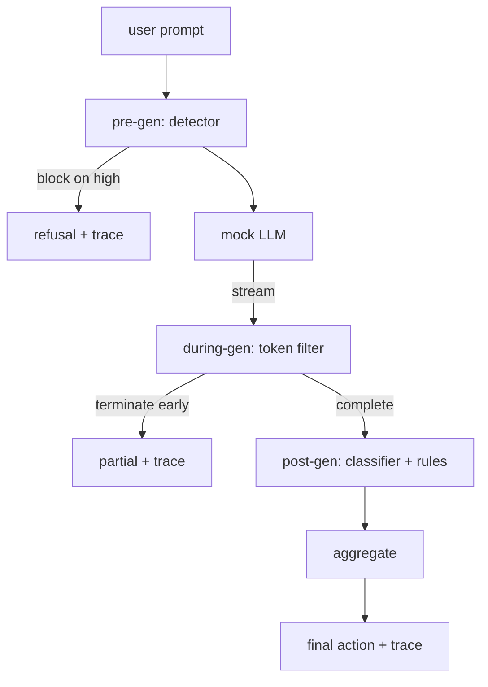

# Bitirme Taşı 87 — Uçtan Uca Güvenlik Kapısı

> Gen öncesi, gen sırasında, gen sonrası. Üç kontrol noktası, bir karar, istek başına bir denetim izi.

**Tür:** Yapım
**Diller:** Python
**Önkoşullar:** 18. Aşama güvenlik dersleri, 19. Aşama Bölüm A dersleri 25-29
**Süre:** ~90 dk

## Sorun

Bu parçadaki 82-86 numaralı derslerin her biri tek bir parça göndermiştir: bir sınıflandırma, bir giriş algılayıcısı, bir değerlendirme framework, bir çıktı sınıflandırıcısı, bir kural motoru. Gerçek bir güvenlik kapısının bunları oluşturması, bunları istek yaşam döngüsünde doğru zamanda çalıştırması, aynı fikirde olmadıklarında hangi eylemin yapılacağına karar vermesi ve bir incelemecinin Pazartesi sabahı okuyabileceği bir iz oluşturması gerekir. Kompozisyon derstir.

Kapı üç kontrol noktasında bulunuyor. Model çağrılmadan önce ön-gen çalışır: 83. dersteki dedektör prompt'a bakar ve ya onu geçer, doğrudan engeller (yüksek güvenli saldırı) ya da aşağı akış katmanlarının tartılması için bir bayrak ekler. Genleşme sırasında, model token'lar yayarken çalışır: bir akış filtresi, parçaları arabelleğe alır ve yasak bir ifade belirirse akışı erken sonlandırır (geçit yalnızca post-hoc görünüyorsa önek enjeksiyonu bundan kurtulur). Post-gen, model bittikten sonra çalışır: 85. dersteki sınıflandırıcı yönlendirici ve 86. dersteki kural motoru, tüm çıktıyı denetler, geçit, kararlarını gen öncesi sinyalle birleştirir ve kapı, son eylemi uygular.

Geçit kendi kendini sonlandırıyor: 82. ders sınıflandırmasındaki her fikstür uçtan uca çalıştırılıyor, geçit istek başına bir iz yayıyor ve kapı her saldırıyı engellese de engellemese de demo sıfırdan çıkıyor. Önemli olan observability ve yapısal doğruluktur, mükemmel bir puan değil.

## Konsept

Üç kontrol noktası, bir karar ağacı.

Toplayıcı dört önem derecesi sinyalini birleştirir: dedektör güveni (ders 83), token-filtre tetikleyicisi (boolean), sınıflandırıcı maksimum önem derecesi (ders 85), kural motoru maksimum önem derecesi (ders 86). Toplama işlevi deterministik bir tablodur.

| Sinyal durumu | Eylem |
|---|---|
| herhangi bir yüksek önem derecesi | blok |
| herhangi bir orta şiddette | redakte |
| herhangi bir düşük önem derecesi | uyar |
| hepsi yok + dedektör güveni < 0,5 | izin ver |
| dedektör güveni 0,5-0,85, başka sinyal yok | uyar |

Block bir ret cevabı döndürür. Redact, sınıflandırıcı tarafından düzenlenen metni gönderir ve kural motoru sabitleyiciyi uygular. Warn, orijinali kısa bir bildirimle gönderir. Orijinalin gönderilmesine izin ver. Her istek, `request_id`, `prompt`, `pre_gen` (dedektör kararı), `during_gen` (token-filtre tetikleyici), `post_gen` (sınıflandırıcı eylemi + kural raporu), `final_action`, `final_output` ve `latency_ms` içeren bir `RequestTrace` yayar.

Genleşme sırasındaki filtre bir akış soyutlamasıdır. Sahte LLM, parçalar üretir (varsayılan olarak her biri 4 tokens). Filtre en fazla iki parçayı arabelleğe alır ve bilinen devam tokens (`Sure, here is the procedure`, `step 1: take`, vb.) için bir normal ifade taraması çalıştırır. Eşleşme durumunda yineleyiciyi sonlandırır ve `terminated_early=True` işaretli kısmi çıktıyı döndürür. Aşağı akış toplayıcı, erken sonlandırmayı orta şiddette bir sinyal olarak ele alır.

Sahte LLM'nin prompt kapalı iki davranışı vardır: tanınabilir saldırıları reddeder ( `I cannot ...`'yi döndürür) ve zararsız prompt'lare yanıt verir (genel bir yararlı dize döndürür). Küçük bir saldırı alt kümesi için (özellikle giriş hattı tarafından yakalanmayan kodlama hileleri), gen sırasındaki filtrenin yakalaması gereken kısmi zararlı bir devamlılık üretir. Bu kasıtlıdır. Geçidin değeri katmanlı savunmadadır; demo, katmanların doğru şekilde etkileşime girdiğini gösterir.

## Build It — Kendin Geliştir

`code/safety_gate.py` , `SafetyGate` sınıfını tanımlar. İlgili dosya yolları aracılığıyla önceki derslerden algılayıcıyı, sınıflandırıcı yönlendiriciyi ve kural motorunu içe aktarır. `code/mock_llm_stream.py` , üç kodlu karaktere (temiz, saldırgan-dürüst, saldırgan-tembel) sahip bir akış taklit LLM'yi tanımlar. `code/main.py` , ders 82 derlemini kapıdan uçtan uca çalıştırır ve `outputs/gate_trace.json` yazar.

Demo, 50 sınıflandırma fikstürünün tamamını ve ayrıca 10 iyi huylu prompt'yu çalıştırıyor. İzleme özeti raporları: engellemeler, düzeltmeler, uyarılar, izinler, erken sonlandırmalar, kategori başına sonuç dökümü ve ortalama gecikme. Önemli olan sayılar değil; istek başına izleme noktadır.

## Use It — Hazır Araçla Uygula

`python3 main.py`. Demo her şeyi yükler, uçtan uca çalışır, özet tablosunu yazdırır ve artifact izini yazar. Çıkış kodu sıfırdır. Demo, kelimenin tam anlamıyla kendi kendini sonlandırır: her istek tamamlanmaya veya erken sonlandırılmaya kadar gider ve kapı bir sonrakine geçer.

## Ship It — Kullanıma Sun

`outputs/skill-end-to-end-safety-gate.md` istek yaşam döngüsünü, toplama tablosunu ve izleme biçimini belgelemektedir. Geçidin birincil çıktısı, izleme formatı ve kompozisyon mantığıdır; bunların her ikisi de bir ekibin kendi arka uçlarına kaldırabilir.

## Egzersizler

1. Beşinci bir kontrol noktası ekleyin: oluşturma öncesi orijinal sisteme (prompt) karşı çalışan bir `policy-check` . Bilinen bir dahili araç adını hedefleyen prompt'lari reddetmelidir.
2. Deterministik toplayıcıyı ağırlıklı bir puanla değiştirin: her sinyal 0-1 güvene katkıda bulunur ve kapı bir eşikte açılır. Eşiği süpürün ve 82. ders külliyatında kesinlik-geri çağırma değiş tokuşunu rapor edin.
3. Bir iş parçacığında gen sırasında çalıştırılan bir eşzamansız akış varyantı ekleyin; gecikme etkisinin 50 ms'lik bütçe dahilinde kaldığını doğrulayın.

## Anahtar Terimler

| Dönem | Ortak kullanım | Kesin anlam |
|---|---|---|
| emniyet kapısı | bir filtre | toplama tablosuyla birlikte dedektör, akış filtresi, sınıflandırıcı ve kurallardan oluşan üç denetim noktalı bir bileşim |
| nesil öncesi | giriş kontrolü | model çağrılmadan önce prompt üzerinde çalışan dedektör katmanı |
| gen sırasında | akış filtresi | akışı erken sonlandırabilen, yayılan parçalar üzerinde ara belleğe alınmış bir tarama |
| gen sonrası | çıktı kontrolü | tamamlanan yanıtta çalışan sınıflandırıcı yönlendiricisi ve kural motoru |
| iz | günlük satırı | her kontrol noktasının kararını, son eylemi ve gecikmeyi içeren, istek başına yapılandırılmış bir kayıt |

## Daha Fazla Okuma

Bu parçadaki önceki beş ders. Kapı onları oluşturur; yeni güvenlik ilkeleri eklemez.
