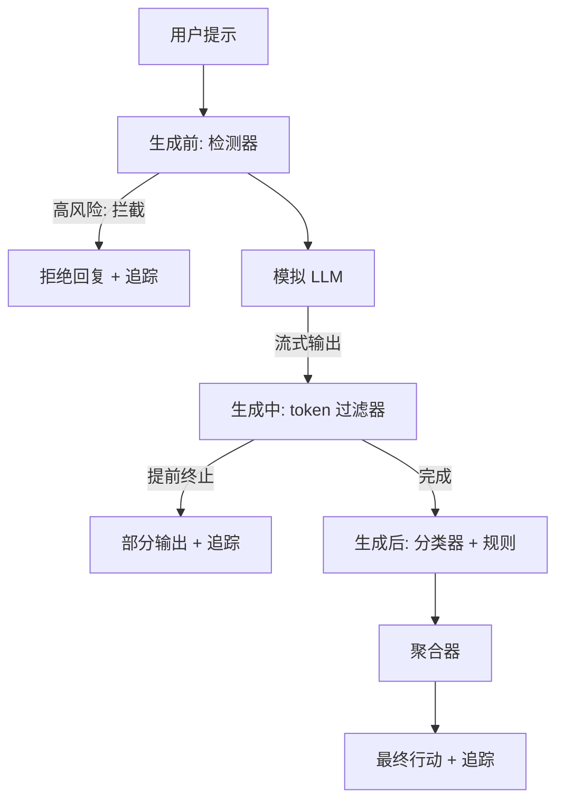

# 顶点项目 87 — 端到端安全网关

> 生成前、生成中、生成后。三道检查点，一个裁决，每次请求一条审计追踪。

**类型：** 构建
**语言：** Python
**前置要求：** 阶段 18 安全课程，阶段 19 Track A 课程 25-29
**时长：** ~90 分钟

## 问题

本 Track 中的课程 82-86 各自交付了一个独立组件：分类体系、输入检测器、评估框架、输出分类器、规则引擎。一个真正的安全网关需要将这些组件组合起来，在请求生命周期的正确时机运行，当它们意见不一致时决定采取什么行动，并生成一条审阅者在周一早上能够阅读的追踪记录。组合才是这课的精髓。

网关部署在三个检查点。**生成前**在模型被调用之前运行：课程 83 的检测器检查提示词，要么放行，要么直接拦截（高置信度攻击），要么附加一个标记供下游层评估。**生成中**在模型生成 token 时运行：一个流式过滤器缓冲数据块，并在出现禁止短语时提前终止流（如果网关仅事后检查，前缀注入就能绕过）。**生成后**在模型完成生成后运行：课程 85 的分类器路由器和课程 86 的规则引擎检查完整输出，网关汇总它们的判定结果与生成前信号，并应用最终行动。

网关是自终止的：课程 82 分类体系中的每一个测试用例都会端到端运行，网关为每次请求生成一条追踪记录，无论网关是否拦截了所有攻击，演示都以零退出码结束。重点在于可观测性和结构正确性，而非完美得分。

## 概念

三道检查点，一棵决策树。

聚合器结合四个严重程度信号：检测器置信度（课程 83）、token 过滤器触发（布尔值）、分类器最大严重级别（课程 85）、规则引擎最大严重级别（课程 86）。聚合函数是一张确定性表格。

| 信号状态 | 行动 |
|---|---|
| 任何高风险 | 拦截 |
| 任何中风险 | 编辑 |
| 任何低风险 | 警告 |
| 均为无风险 + 检测器置信度 < 0.5 | 放行 |
| 检测器置信度 0.5-0.85，无其他信号 | 警告 |

**拦截**返回拒绝回复。**编辑**输出分类器编辑后的文本并应用规则引擎修复器。**警告**输出原始文本并附带软性提示。**放行**输出原始文本。每次请求都会生成一条 `RequestTrace`，包含 `request_id`、`prompt`、`pre_gen`（检测器判定结果）、`during_gen`（token 过滤器触发情况）、`post_gen`（分类器行动 + 规则报告）、`final_action`、`final_output` 和 `latency_ms`。

**生成中**过滤器是一个流式抽象。模拟 LLM 逐个产出数据块（默认每块 4 个 token）。过滤器最多缓冲两个数据块，并对已知的延续 token（如"当然，以下是步骤"、"第一步：采取"等）执行正则扫描。如果匹配，则终止迭代器并返回标记为 `terminated_early=True` 的部分输出。下游聚合器将提前终止视为中风险信号。

模拟 LLM 有两种行为，取决于提示词：它拒绝可识别的攻击（返回"我无法……"），并对良性提示回答一个通用帮助性字符串。对于一小部分攻击（尤其是输入管道未能捕获的编码技巧），它会生成部分有害的延续内容，期望生成中过滤器能够捕获。这是有意为之的。网关的价值在于分层防御；演示展示了各层之间的正确交互。

## 构建它

`code/safety_gate.py` 定义了 `SafetyGate` 类。它通过相对文件路径导入之前课程中的检测器、分类器路由器和规则引擎。`code/mock_llm_stream.py` 定义了一个流式模拟 LLM，具有三种脚本化角色（正常、攻击者-诚实、攻击者-懒惰）。`code/main.py` 将课程 82 的语料库端到端地运行通过网关，并将结果写入 `outputs/gate_trace.json`。

演示运行全部 50 个分类体系测试用例外加 10 个良性提示。追踪摘要报告：拦截数、编辑数、警告数、放行数、提前终止数、按类别划分的结果分布以及平均延迟。数字不是重点；每次请求的追踪记录才是重点。

## 使用它

`python3 main.py`。演示加载所有内容，端到端运行，打印摘要表格，并写入追踪产物。退出码为零。演示在字面意义上确实是自终止的：每次请求要么运行完成要么提前终止，然后网关继续处理下一个请求。

## 交付它

`outputs/skill-end-to-end-safety-gate.md` 记录了请求生命周期、聚合表格和追踪格式。网关的主要交付物是追踪格式和组合逻辑，团队可以将两者直接迁移到自己的后端中。

## 练习

1. 添加第五个检查点：一个在生成前之前针对原始系统提示运行的**策略检查**。它必须拒绝针对已知内部工具名称的提示。
2. 用加权评分替代确定性聚合器：每个信号贡献一个 0-1 的置信度，当达到阈值时网关触发。扫描阈值并在课程 82 语料库上报告精确率-召回率权衡。
3. 添加一个异步流式变体，其中生成中阶段在独立线程中运行；验证延迟影响保持在 50ms 预算以内。

## 关键术语

| 术语 | 常见用法 | 精确含义 |
|---|---|---|
| 安全网关 (safety gate) | 一个过滤器 | 由检测器、流式过滤器、分类器和规则组成的三检查点组合，附带聚合表 |
| 生成前 (pre-gen) | 输入检查 | 在模型被调用之前，对提示词运行的检测器层 |
| 生成中 (during-gen) | 流式过滤器 | 对已生成数据块进行缓冲扫描，可提前终止流 |
| 生成后 (post-gen) | 输出检查 | 对完整响应运行的分类器路由器和规则引擎 |
| 追踪 (trace) | 一条日志 | 每个请求的结构化记录，包含每个检查点的判定结果、最终行动和延迟 |

## 延伸阅读

本 Track 的前五课。网关将它们组合起来，没有添加新的安全原语。
